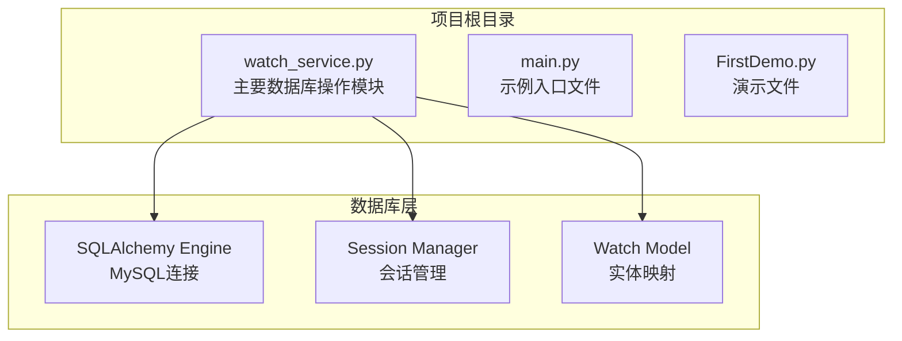
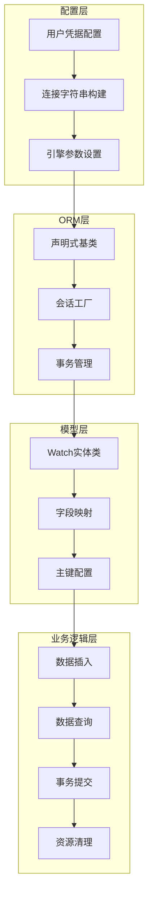
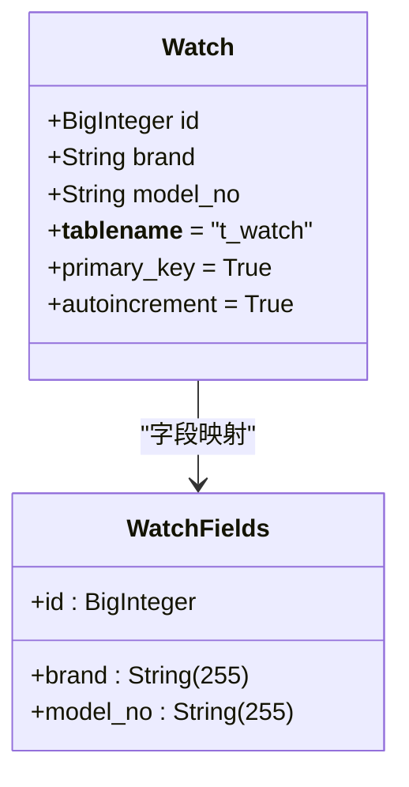
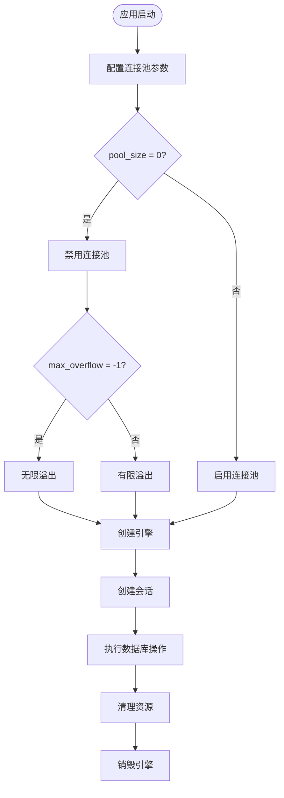
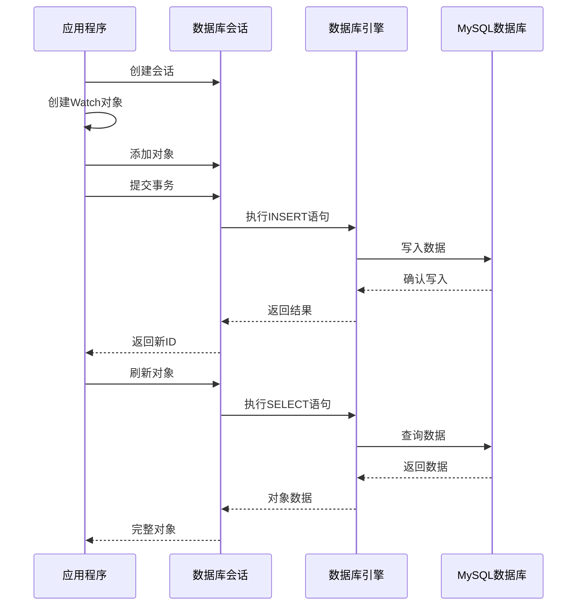
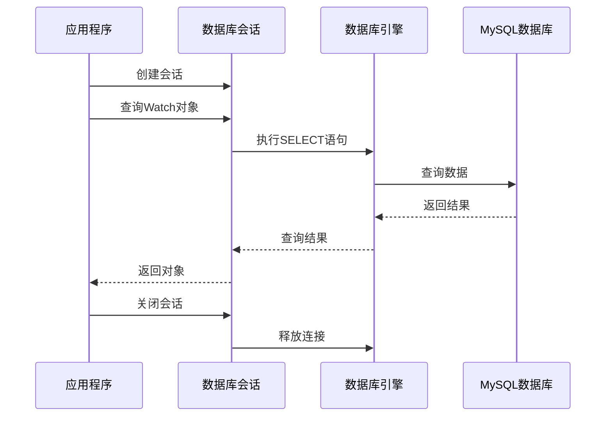
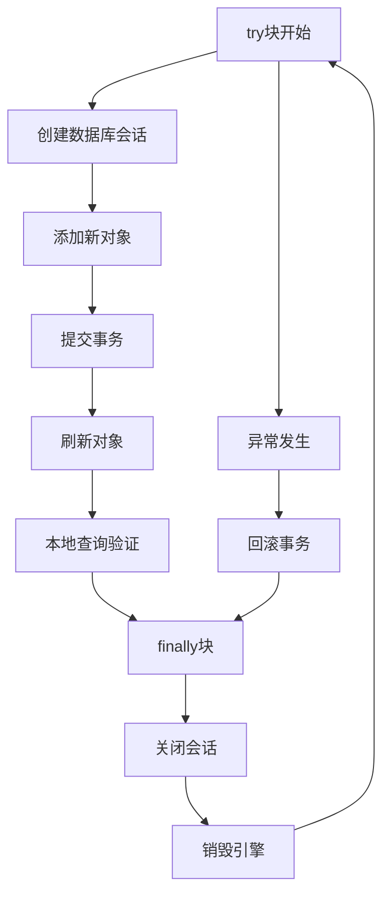
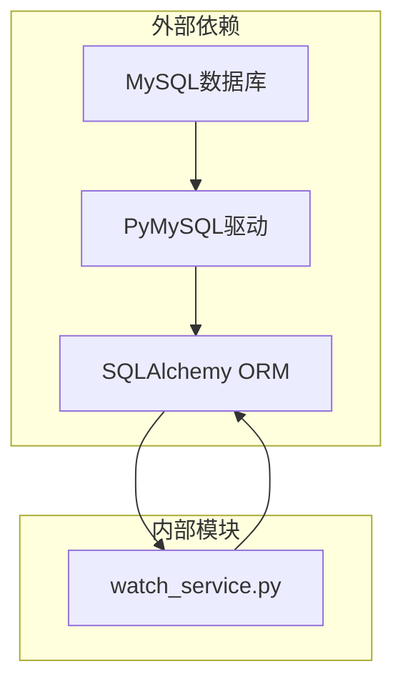

# 数据库操作指南

<cite>
**本文档引用的文件**
- [watch_service.py](file://watch_service.py)
- [main.py](file://main.py)
- [FirstDemo.py](file://FirstDemo.py)
</cite>

## 目录
1. [简介](#简介)
2. [项目结构](#项目结构)
3. [核心组件](#核心组件)
4. [架构概览](#架构概览)
5. [详细组件分析](#详细组件分析)
6. [依赖关系分析](#依赖关系分析)
7. [性能考虑](#性能考虑)
8. [故障排除指南](#故障排除指南)
9. [结论](#结论)

## 简介

本指南专注于watch_service.py模块中的数据库集成实现，该模块使用SQLAlchemy ORM进行MySQL数据库操作。该实现采用极简设计原则，专注于手表(t_watch)表的数据管理功能，提供了完整的CRUD操作示例和最佳实践指导。

## 项目结构

该项目采用简单的单模块架构，专注于数据库操作功能：

**图表来源**
- [watch_service.py:1-52](file://watch_service.py#L1-L52)

**章节来源**
- [watch_service.py:1-52](file://watch_service.py#L1-L52)
- [main.py:1-17](file://main.py#L1-L17)
- [FirstDemo.py:1-11](file://FirstDemo.py#L1-L11)

## 核心组件

### 数据库连接配置

该模块实现了最小化的数据库连接配置，重点关注连接池管理和事务控制：

- **用户凭据配置**：支持用户名、密码、数据库名和端口的灵活配置
- **连接字符串格式**：使用标准的mysql+pymysql协议
- **字符集设置**：配置utf8mb4以支持完整的Unicode字符
- **连接池策略**：禁用连接池以避免事务挂起问题

### SQLAlchemy ORM配置

模块采用声明式基类模式，实现了以下核心配置：

- **引擎创建**：使用create_engine函数创建数据库引擎
- **会话工厂**：通过sessionmaker创建会话管理器
- **自动提交控制**：禁用自动提交，手动控制事务
- **自动刷新控制**：禁用自动刷新，精确控制数据同步

**章节来源**
- [watch_service.py:6-21](file://watch_service.py#L6-L21)

## 架构概览

该模块采用分层架构设计，清晰分离了配置层、模型层和业务逻辑层：

**图表来源**
- [watch_service.py:6-48](file://watch_service.py#L6-L48)

## 详细组件分析

### Watch实体类分析

Watch实体类是t_watch表的ORM映射，实现了完整的字段定义和约束配置：

**图表来源**
- [watch_service.py:22-28](file://watch_service.py#L22-L28)

#### 字段定义详解

| 字段名 | 数据类型 | 约束条件 | 描述 |
|--------|----------|----------|------|
| id | BigInteger | 主键, 自增 | 唯一标识符 |
| brand | String(255) | 非空 | 品牌名称 |
| model_no | String(255) | 非空, 默认空字符串 | 型号编号 |

#### 主键配置分析

实体类使用复合主键策略：
- **单一主键**：id字段作为唯一主键
- **自增机制**：启用数据库自增功能
- **类型选择**：使用BigInteger确保足够大的数值范围

**章节来源**
- [watch_service.py:22-28](file://watch_service.py#L22-L28)

### 数据库连接池工作原理

该实现采用了特殊的连接池配置策略：

**图表来源**
- [watch_service.py:13-18](file://watch_service.py#L13-L18)

#### 连接池配置策略

- **pool_size=0**：完全禁用连接池，避免连接泄漏
- **max_overflow=-1**：允许无限数量的溢出连接
- **优势**：防止事务挂起和连接泄漏
- **适用场景**：短时任务和一次性操作

**章节来源**
- [watch_service.py:13-18](file://watch_service.py#L13-L18)

### CRUD操作实现

#### 数据插入操作

**图表来源**
- [watch_service.py:33-47](file://watch_service.py#L33-L47)

#### 数据查询操作

**图表来源**
- [watch_service.py:42](file://watch_service.py#L42)

**章节来源**
- [watch_service.py:33-47](file://watch_service.py#L33-L47)

### 事务管理最佳实践

该模块实现了严格的事务管理策略：

**图表来源**
- [watch_service.py:33-48](file://watch_service.py#L33-L48)

#### 异常处理机制

- **try块**：包含所有数据库操作
- **finally块**：确保资源清理
- **自动回滚**：异常时自动回滚未提交的事务
- **资源释放**：强制关闭会话和销毁引擎

**章节来源**
- [watch_service.py:33-48](file://watch_service.py#L33-L48)

## 依赖关系分析

该模块的依赖关系相对简单，主要依赖SQLAlchemy框架：

**图表来源**
- [watch_service.py:2-4](file://watch_service.py#L2-L4)

### 外部依赖分析

- **SQLAlchemy**：提供ORM功能和数据库抽象
- **PyMySQL**：MySQL数据库驱动程序
- **MySQL**：目标数据库系统

### 内部模块关系

- **watch_service.py**：主要业务逻辑模块
- **其他文件**：示例和演示文件，不参与数据库操作

**章节来源**
- [watch_service.py:2-4](file://watch_service.py#L2-L4)

## 性能考虑

### 连接池优化策略

由于禁用了连接池，该实现采用以下优化策略：

- **连接复用**：通过引擎级别的连接复用来减少开销
- **批量操作**：支持批量插入和查询操作
- **延迟加载**：使用懒加载策略减少不必要的数据传输

### 资源管理优化

- **及时清理**：在finally块中确保资源清理
- **连接回收**：通过engine.dispose()回收所有连接
- **内存管理**：避免长时间持有大量对象引用

### 安全考虑

- **SQL注入防护**：使用ORM参数化查询
- **凭据保护**：敏感信息存储在配置变量中
- **字符集配置**：使用utf8mb4支持完整Unicode

## 故障排除指南

### 常见问题及解决方案

#### 连接失败问题

**症状**：无法连接到MySQL数据库
**可能原因**：
- 数据库服务未启动
- 用户凭据错误
- 网络连接问题
- 端口配置错误

**解决步骤**：
1. 验证MySQL服务状态
2. 检查用户凭据配置
3. 确认网络连通性
4. 验证端口配置

#### 事务挂起问题

**症状**：应用程序长时间占用数据库连接
**可能原因**：
- 会话未正确关闭
- 事务未正确提交或回滚
- 连接池配置不当

**解决步骤**：
1. 确保finally块中的资源清理
2. 检查事务提交逻辑
3. 验证连接池配置

#### 数据一致性问题

**症状**：查询结果与预期不符
**可能原因**：
- 事务隔离级别问题
- 缓存数据未刷新
- 并发访问冲突

**解决步骤**：
1. 使用db.refresh()刷新对象状态
2. 检查事务边界
3. 实现适当的并发控制

**章节来源**
- [watch_service.py:51-52](file://watch_service.py#L51-L52)

## 结论

watch_service.py模块展示了SQLAlchemy ORM的最佳实践实现，特别适用于需要精确控制数据库连接和事务管理的场景。该实现通过禁用连接池来避免常见的连接泄漏问题，同时提供了完整的CRUD操作示例。

### 主要优势

- **简洁性**：极简的实现减少了复杂性
- **可靠性**：严格的资源管理和异常处理
- **可维护性**：清晰的代码结构和注释
- **安全性**：内置的SQL注入防护和凭据管理

### 改进建议

对于生产环境，建议考虑以下改进：
- 实现连接池配置选项
- 添加更详细的日志记录
- 增加重试机制和超时处理
- 实现更完善的错误分类和处理

该模块为理解SQLAlchemy ORM的基本概念和最佳实践提供了优秀的学习案例，特别适合初学者理解和参考。