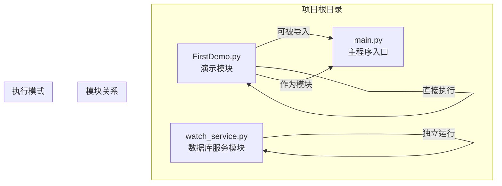
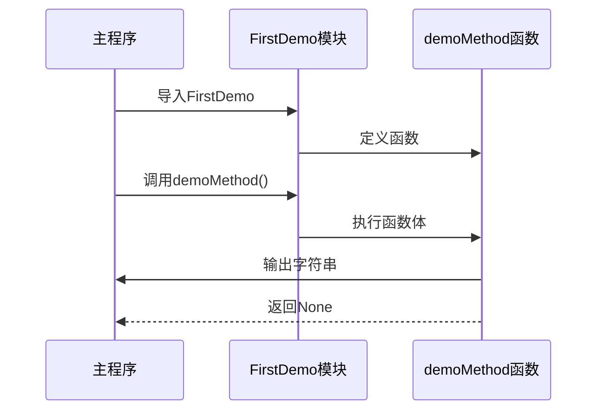
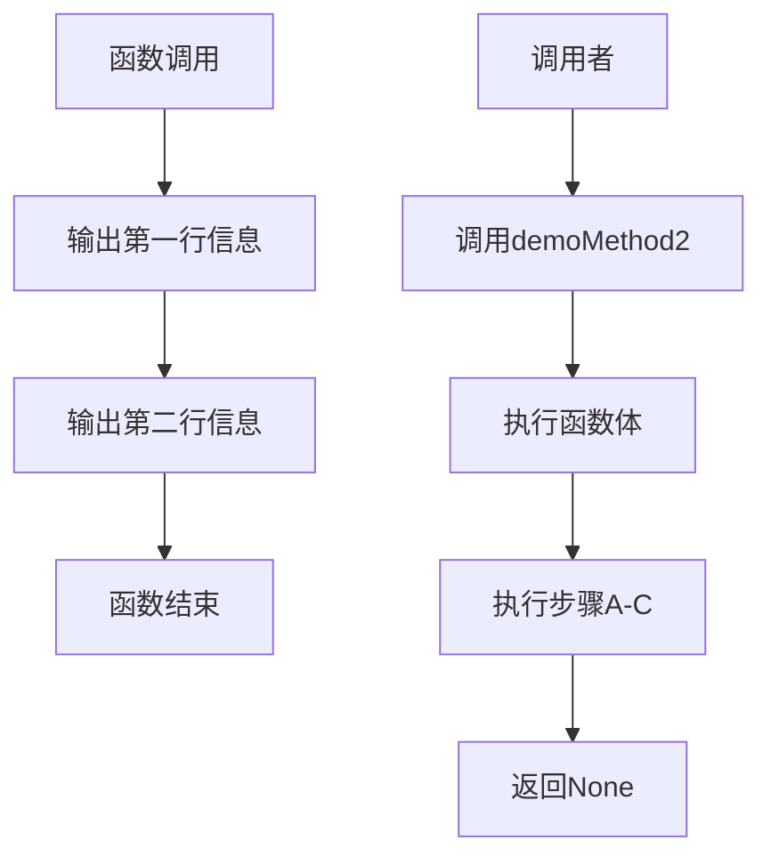
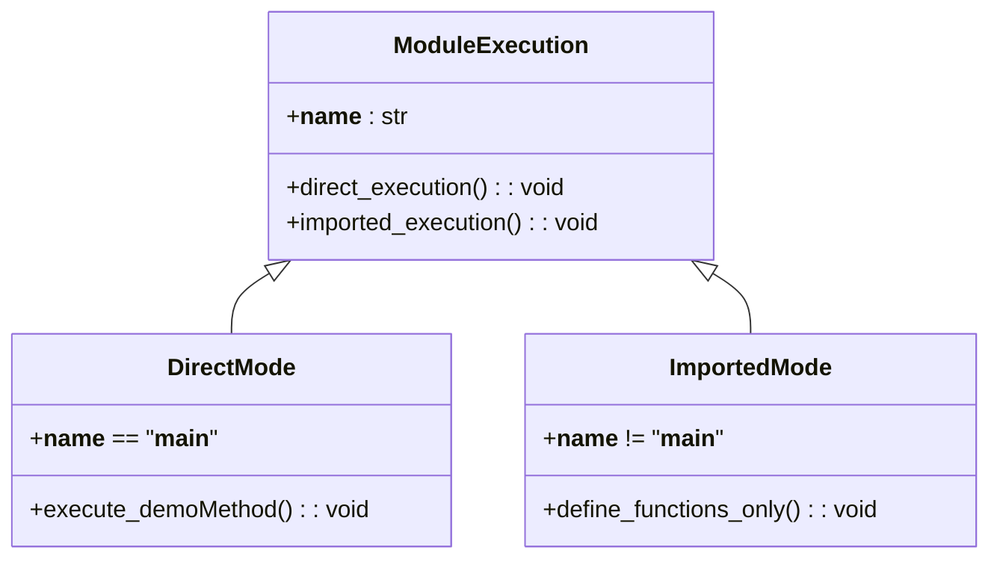
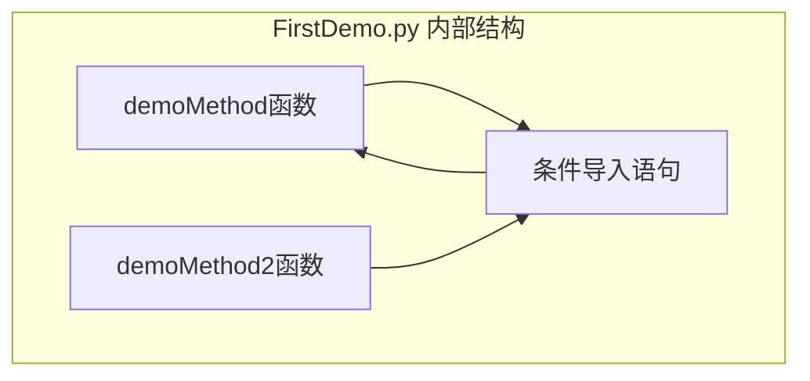
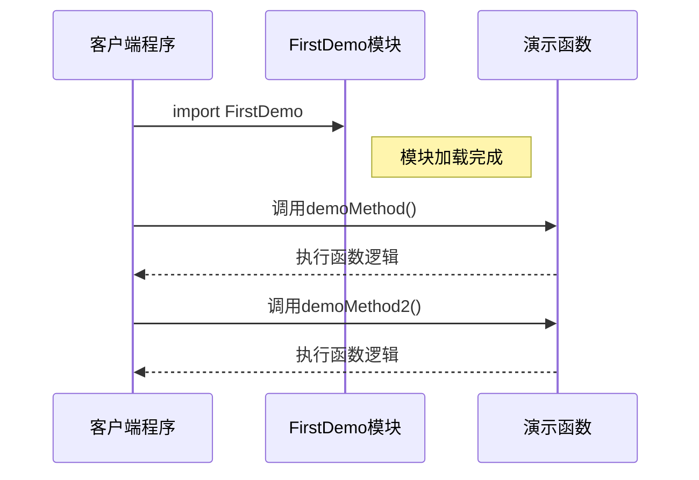

# FirstDemo.py 演示模块

<cite>
**本文档引用的文件**
- [FirstDemo.py](file://FirstDemo.py)
- [main.py](file://main.py)
- [watch_service.py](file://watch_service.py)
</cite>

## 目录
1. [简介](#简介)
2. [项目结构](#项目结构)
3. [核心组件](#核心组件)
4. [架构概览](#架构概览)
5. [详细组件分析](#详细组件分析)
6. [依赖关系分析](#依赖关系分析)
7. [性能考虑](#性能考虑)
8. [故障排除指南](#故障排除指南)
9. [结论](#结论)

## 简介

FirstDemo.py 是一个极简的Python演示模块，展示了Python模块化编程的基本概念和最佳实践。该模块包含两个演示函数，演示了如何创建可重用的代码单元，并通过条件导入机制实现了模块的双重用途：既可作为独立脚本运行，也可作为模块被其他程序导入使用。

该模块的设计体现了Python编程的核心原则：模块化、可重用性和清晰的边界定义。通过简单的函数定义和条件导入语句，它为初学者提供了一个理解Python模块系统和函数组织的良好示例。

## 项目结构

整个项目采用扁平化的文件组织方式，包含三个主要文件：



**图表来源**
- [FirstDemo.py:1-11](file://FirstDemo.py#L1-L11)
- [main.py:1-17](file://main.py#L1-L17)
- [watch_service.py:1-52](file://watch_service.py#L1-L52)

**章节来源**
- [FirstDemo.py:1-11](file://FirstDemo.py#L1-L11)
- [main.py:1-17](file://main.py#L1-L17)
- [watch_service.py:1-52](file://watch_service.py#L1-L52)

## 核心组件

FirstDemo.py模块包含以下核心组件：

### 主要函数组件

1. **demoMethod()** - 第一个演示函数
   - 功能：输出欢迎信息到控制台
   - 特点：简单直接的字符串输出
   - 使用场景：基础的函数演示

2. **demoMethod2()** - 第二个演示函数  
   - 功能：输出重复的欢迎信息
   - 特点：展示函数内部的重复逻辑
   - 使用场景：演示函数的多行执行能力

### 条件导入机制

模块底部的条件导入语句提供了灵活的执行控制：

```python
if __name__ == '__main__':
    demoMethod()
```

这种设计模式允许模块以两种不同的方式工作：
- **独立执行模式**：直接运行脚本时触发演示函数
- **模块导入模式**：被其他程序导入时不自动执行

**章节来源**
- [FirstDemo.py:1-11](file://FirstDemo.py#L1-L11)

## 架构概览

FirstDemo.py模块采用了简洁而有效的架构设计，体现了Python模块化编程的最佳实践：

```mermaid
flowchart TD
A[模块加载] --> B{检查执行上下文}
B --> |直接运行| C[执行条件导入块]
B --> |被导入| D[仅定义函数]
C --> E[demoMethod()执行]
D --> F[等待外部调用]
E --> G[输出结果]
F --> H[等待调用者触发]
G --> I[程序结束]
H --> J[接收调用请求]
J --> K[执行相应函数]
K --> L[返回结果]
```

**图表来源**
- [FirstDemo.py:4-5](file://FirstDemo.py#L4-L5)

### 执行流程分析

该模块的执行流程遵循Python的标准模块加载机制：

1. **模块加载阶段**：Python解释器读取并编译FirstDemo.py文件
2. **全局变量初始化**：所有函数定义被解析但不执行
3. **条件判断**：检查`__name__`特殊变量的值
4. **分支执行**：
   - 直接运行时：`__name__`等于`'__main__'`，执行演示函数
   - 被导入时：`__name__`等于模块名，跳过演示逻辑

**章节来源**
- [FirstDemo.py:4-5](file://FirstDemo.py#L4-L5)

## 详细组件分析

### 函数组件深度分析

#### demoMethod() 函数分析



**图表来源**
- [FirstDemo.py:1-2](file://FirstDemo.py#L1-L2)

该函数展现了Python函数的基本特征：
- **单一职责**：专注于输出预定义的字符串
- **无参数设计**：简化调用复杂度
- **无返回值**：直接进行副作用操作

#### demoMethod2() 函数分析



**图表来源**
- [FirstDemo.py:7-9](file://FirstDemo.py#L7-L9)

该函数展示了更复杂的函数行为：
- **多行执行**：包含两条独立的输出语句
- **重复逻辑**：两条相同的输出语句形成重复模式
- **副作用操作**：直接与标准输出交互

### 条件导入机制详解



**图表来源**
- [FirstDemo.py:4-5](file://FirstDemo.py#L4-L5)

#### 条件判断逻辑

条件导入语句的工作原理：

1. **`__name__`变量**：Python内置的特殊变量，标识当前模块的名称
2. **直接运行检测**：当脚本直接执行时，`__name__`值为`'__main__'`
3. **导入检测**：当模块被其他程序导入时，`__name__`值为模块名
4. **分支控制**：根据`__name__`的值决定执行路径

**章节来源**
- [FirstDemo.py:4-5](file://FirstDemo.py#L4-L5)

## 依赖关系分析

### 内部依赖关系

FirstDemo.py模块具有极简的依赖结构：



**图表来源**
- [FirstDemo.py:1-11](file://FirstDemo.py#L1-L11)

### 外部依赖关系

从代码分析可见，FirstDemo.py模块不依赖任何外部库或第三方模块。它仅使用Python标准库中的基本功能。

### 模块间交互模式

虽然FirstDemo.py本身不依赖其他模块，但它展示了Python模块间的标准交互模式：



**图表来源**
- [FirstDemo.py:1-11](file://FirstDemo.py#L1-L11)

**章节来源**
- [FirstDemo.py:1-11](file://FirstDemo.py#L1-L11)

## 性能考虑

### 内存使用特性

FirstDemo.py模块具有以下内存使用特点：

- **零外部依赖**：不占用额外的内存空间用于第三方库
- **轻量级函数定义**：函数对象占用少量内存
- **字符串常量存储**：演示字符串在内存中驻留直到程序结束

### 执行效率

- **函数调用开销**：每次函数调用都有轻微的栈帧创建成本
- **I/O操作成本**：打印操作涉及系统调用，是主要的性能瓶颈
- **条件判断开销**：`__name__`检查是常量时间操作

### 优化建议

对于类似的小型演示模块，可以考虑：

1. **减少重复输出**：合并相似的输出语句
2. **延迟初始化**：将昂贵的操作移到需要时才执行
3. **缓存策略**：对重复计算的结果进行缓存

## 故障排除指南

### 常见问题及解决方案

#### 问题1：模块无法被正确导入

**症状**：尝试导入FirstDemo模块时报错

**可能原因**：
- 文件路径不在Python路径中
- 模块文件名包含非法字符
- Python环境配置问题

**解决方法**：
- 确保FirstDemo.py位于正确的目录
- 检查文件权限设置
- 验证Python解释器的路径配置

#### 问题2：条件导入逻辑不按预期工作

**症状**：模块被导入时仍然执行了演示函数

**可能原因**：
- 错误地修改了`__name__`变量
- 使用了不正确的比较运算符
- 模块加载顺序问题

**解决方法**：
- 检查条件语句的语法正确性
- 验证`__name__`变量的值
- 确保没有意外修改特殊变量

#### 问题3：函数调用失败

**症状**：调用演示函数时报错

**可能原因**：
- 函数名拼写错误
- 参数传递不当
- 函数作用域问题

**解决方法**：
- 检查函数名的正确性
- 确认函数签名匹配
- 验证函数的可访问性

**章节来源**
- [FirstDemo.py:1-11](file://FirstDemo.py#L1-L11)

## 结论

FirstDemo.py模块虽然结构简单，但完美地展示了Python模块化编程的核心概念和最佳实践。通过两个演示函数和条件导入机制，它为理解Python的模块系统提供了清晰的示例。

该模块的主要价值在于：

1. **教育意义**：为初学者提供了理解模块导入和执行上下文的直观例子
2. **最佳实践示范**：展示了如何编写既可独立运行又可被导入的模块
3. **设计原则体现**：体现了单一职责、简单性等软件设计原则
4. **实用价值**：为实际项目中的模块化开发提供了参考模板

对于更复杂的项目，开发者可以在此基础上扩展，添加更多的函数、类和配置管理，但保持模块化设计的基本原则不变。FirstDemo.py为理解Python生态系统中的模块通信和函数调用流程奠定了坚实的基础。