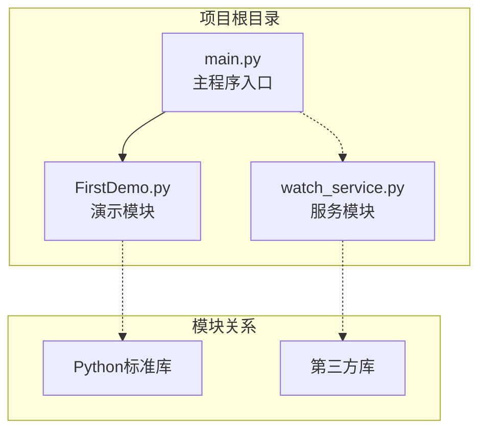
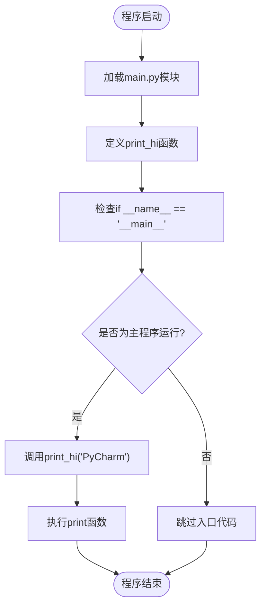
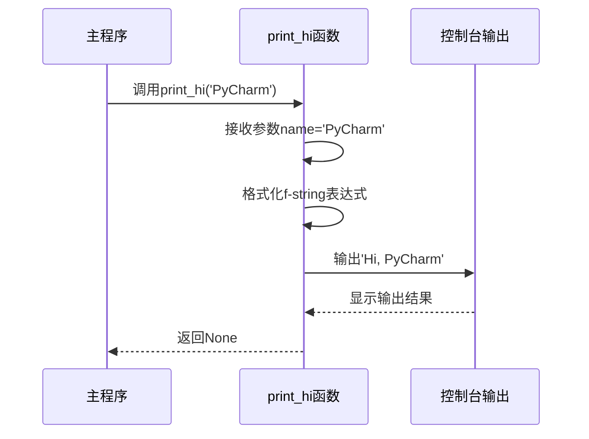
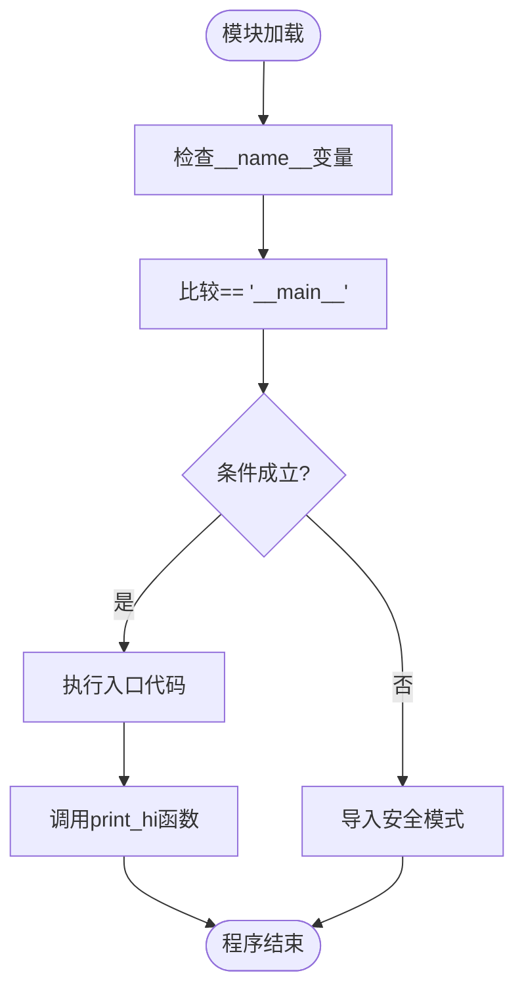
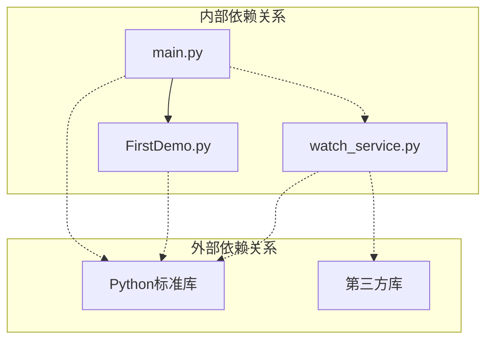

# main.py 主程序模块

<cite>
**本文档引用的文件**
- [main.py](file://main.py)
- [FirstDemo.py](file://FirstDemo.py)
- [watch_service.py](file://watch_service.py)
</cite>

## 目录
1. [简介](#简介)
2. [项目结构](#项目结构)
3. [核心组件](#核心组件)
4. [架构概览](#架构概览)
5. [详细组件分析](#详细组件分析)
6. [依赖关系分析](#依赖关系分析)
7. [性能考虑](#性能考虑)
8. [故障排除指南](#故障排除指南)
9. [结论](#结论)

## 简介

main.py 是一个简单的Python程序入口模块，展示了标准的Python程序结构和模块导入机制。该模块包含一个名为 `print_hi` 的函数，以及使用 `if __name__ == '__main__':` 语句作为程序入口点的标准模式。本文档将深入分析该模块的函数定义模式、程序入口点机制和标准Python程序结构，提供详细的实现原理、参数传递方式和输出格式说明。

## 项目结构

本项目采用简洁的单模块设计，包含三个主要Python文件：



**图表来源**
- [main.py:1-17](file://main.py#L1-L17)
- [FirstDemo.py:1-11](file://FirstDemo.py#L1-L11)
- [watch_service.py:1-52](file://watch_service.py#L1-L52)

**章节来源**
- [main.py:1-17](file://main.py#L1-L17)
- [FirstDemo.py:1-11](file://FirstDemo.py#L1-L11)
- [watch_service.py:1-52](file://watch_service.py#L1-L52)

## 核心组件

### 函数定义模式

main.py模块采用了标准的Python函数定义模式：

- **函数声明**: 使用 `def` 关键字定义函数
- **参数传递**: 支持位置参数和关键字参数
- **文档字符串**: 包含注释说明函数用途
- **返回值**: 该函数不显式返回值（返回None）

### 程序入口点机制

模块的核心入口点是 `if __name__ == '__main__':` 语句块，这是Python的标准模式：

- **条件判断**: 检查模块是否作为主程序运行
- **独立执行**: 当模块被直接运行时执行相应代码
- **导入安全**: 当模块被其他文件导入时不执行入口代码

**章节来源**
- [main.py:7-14](file://main.py#L7-L14)

## 架构概览

main.py模块的执行架构遵循Python的标准程序结构：



**图表来源**
- [main.py:13-14](file://main.py#L13-L14)
- [main.py:7-9](file://main.py#L7-L9)

## 详细组件分析

### print_hi函数分析

#### 函数签名与参数

```mermaid
classDiagram
class PrintHiFunction {
+name : str
+return : None
+print_hi(name) void
}
class FunctionParameters {
+name : str
+description : "用户名称参数"
+validation : "字符串类型检查"
}
class OutputFormat {
+format_type : f-string
+template : "Hi, {name}"
+delimiter : ","
}
PrintHiFunction --> FunctionParameters : "接受"
PrintHiFunction --> OutputFormat : "使用"
```

**图表来源**
- [main.py:7-9](file://main.py#L7-L9)

#### 实现原理

print_hi函数采用以下实现策略：

1. **参数接收**: 接受一个字符串类型的参数 `name`
2. **格式化输出**: 使用f-string格式化字符串，包含问候语和用户名
3. **调试支持**: 包含断点注释，便于调试器使用
4. **编码规范**: 使用UTF-8字符集支持中文输出

#### 参数传递机制



**图表来源**
- [main.py:13-14](file://main.py#L13-L14)
- [main.py:7-9](file://main.py#L7-L9)

#### 输出格式规范

函数输出采用统一的格式规范：
- **前缀**: "Hi, "
- **内容**: 用户提供的名称
- **分隔符**: 逗号和空格
- **编码**: UTF-8支持中文字符

**章节来源**
- [main.py:7-9](file://main.py#L7-L9)

### 程序入口点机制

#### 条件执行逻辑



**图表来源**
- [main.py:13-14](file://main.py#L13-L14)

#### 模块导入机制

当main.py被其他模块导入时的行为：

1. **模块加载**: Python解释器加载main.py文件
2. **函数定义**: 定义print_hi函数但不执行
3. **条件检查**: `if __name__ == '__main__'` 条件为False
4. **导入完成**: 模块准备就绪供其他模块使用

**章节来源**
- [main.py:13-14](file://main.py#L13-L14)

## 依赖关系分析

### 内部模块依赖



**图表来源**
- [main.py:1-17](file://main.py#L1-17)
- [FirstDemo.py:1-11](file://FirstDemo.py#L1-11)
- [watch_service.py:1-52](file://watch_service.py#L1-52)

### 外部库依赖

watch_service.py模块依赖以下第三方库：
- **SQLAlchemy**: ORM框架用于数据库操作
- **PyMySQL**: MySQL数据库驱动
- **SQLAlchemy-Utils**: 数据库工具扩展

**章节来源**
- [watch_service.py:2-4](file://watch_service.py#L2-L4)

## 性能考虑

### 执行效率优化

1. **函数调用开销**: print_hi函数为简单字符串拼接，开销极小
2. **内存使用**: 字符串对象在函数作用域内管理，生命周期短
3. **I/O性能**: print函数调用涉及系统调用，但对用户体验影响可忽略

### 最佳实践建议

- **函数设计**: 保持函数单一职责，避免复杂逻辑
- **参数验证**: 可以添加输入参数类型检查
- **异常处理**: 在生产环境中添加适当的错误处理
- **日志记录**: 使用logging模块替代print进行调试

## 故障排除指南

### 常见问题诊断

#### 模块导入问题

**症状**: 导入main.py时出现语法错误
**原因**: 编码格式或Python版本兼容性问题
**解决方案**: 
- 确保文件保存为UTF-8编码
- 检查Python版本兼容性

#### 函数调用失败

**症状**: 调用print_hi函数时报错
**原因**: 参数类型不正确或缺少参数
**解决方案**:
- 确保传入字符串类型的参数
- 检查函数签名和参数数量

#### 入口点不执行

**症状**: 模块被导入时意外执行了入口代码
**原因**: 对 `if __name__ == '__main__'` 语句理解错误
**解决方案**:
- 理解模块作为脚本运行和作为模块导入的区别
- 确保条件判断的正确性

**章节来源**
- [main.py:7-14](file://main.py#L7-L14)

## 结论

main.py模块虽然代码量较少，但完美展示了Python编程的核心概念和最佳实践。通过分析该模块，我们可以：

1. **理解函数定义模式**: 掌握Python函数的基本语法和参数传递机制
2. **掌握入口点机制**: 理解 `if __name__ == '__main__'` 的重要作用和工作原理
3. **学习模块导入**: 了解Python模块的导入机制和条件执行模式
4. **应用最佳实践**: 将这些概念应用到更复杂的项目开发中

该模块为学习Python编程提供了良好的入门示例，展示了从简单到复杂项目的渐进式学习路径。通过深入理解main.py的设计理念和实现细节，开发者可以更好地构建自己的Python应用程序。