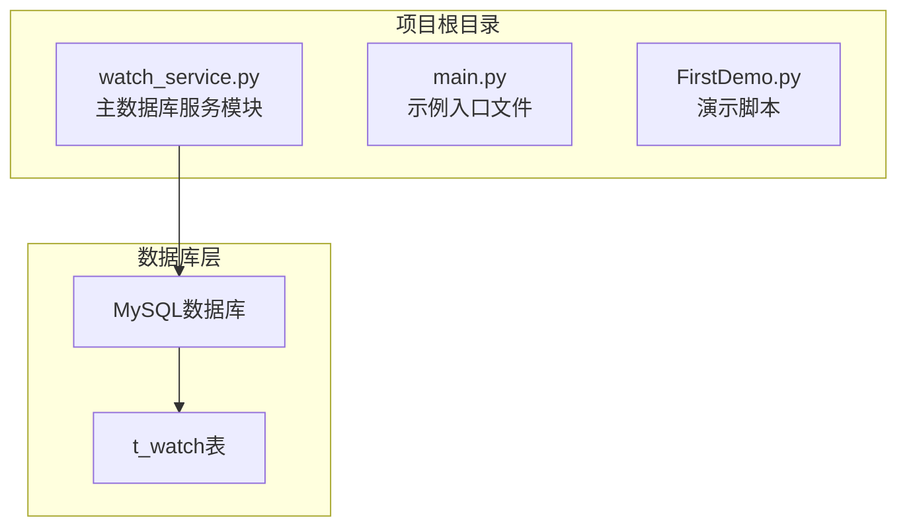
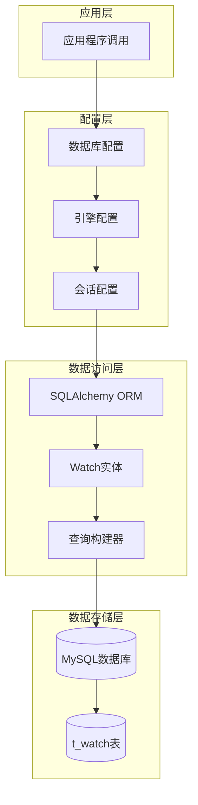
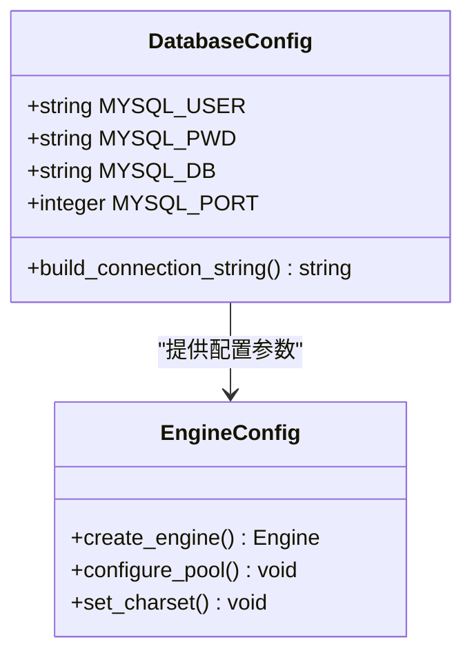
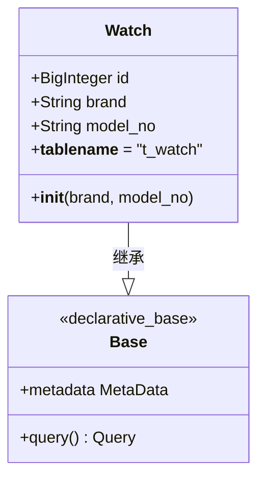
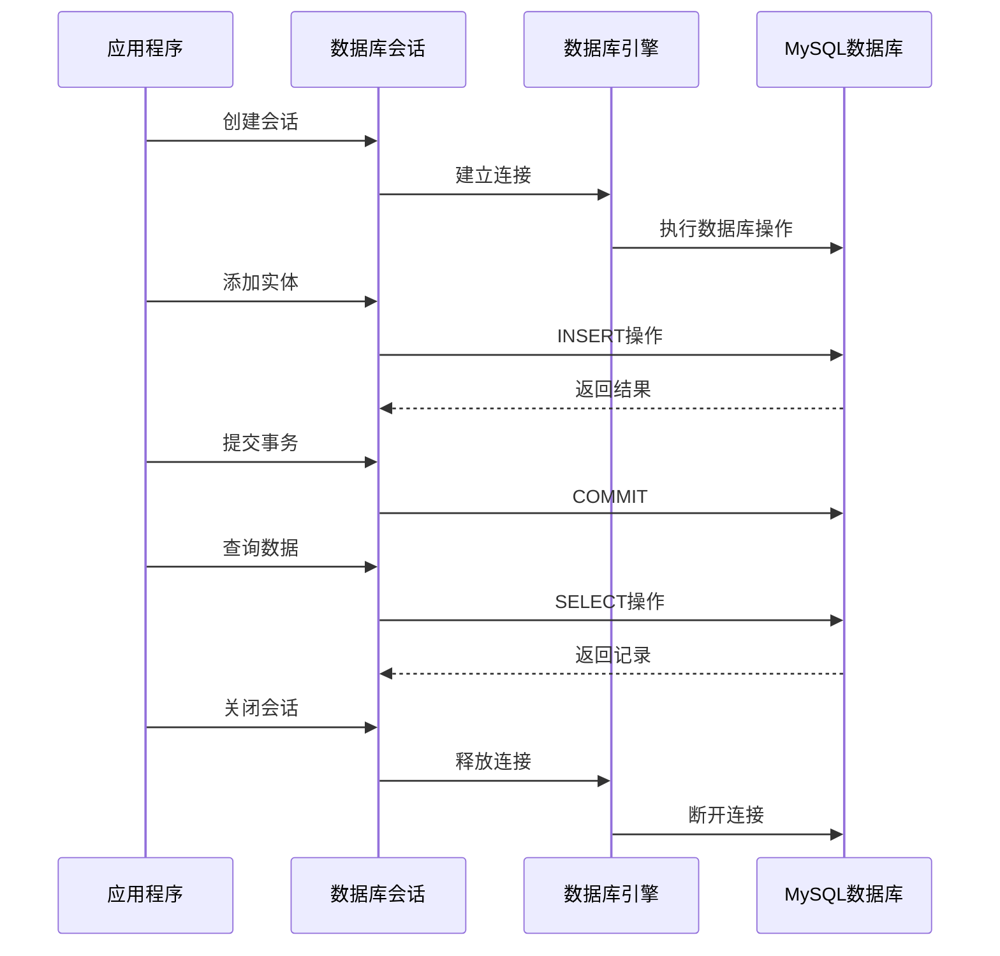
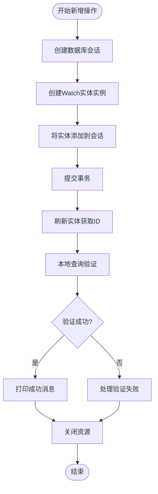
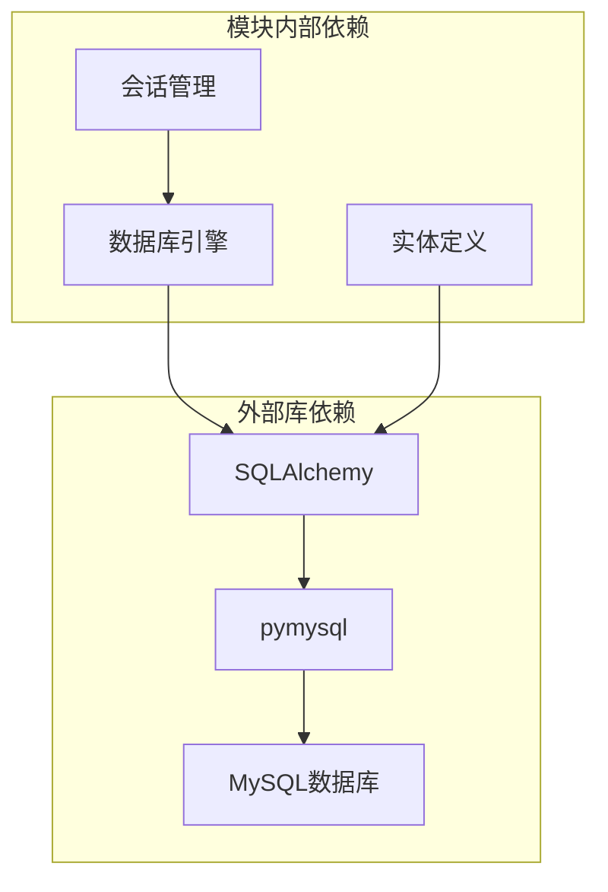

# watch_service.py 数据库服务模块

<cite>
**本文档引用的文件**
- [watch_service.py](file://watch_service.py)
- [main.py](file://main.py)
- [FirstDemo.py](file://FirstDemo.py)
</cite>

## 目录
1. [简介](#简介)
2. [项目结构](#项目结构)
3. [核心组件](#核心组件)
4. [架构概览](#架构概览)
5. [详细组件分析](#详细组件分析)
6. [依赖关系分析](#依赖关系分析)
7. [性能考虑](#性能考虑)
8. [故障排除指南](#故障排除指南)
9. [结论](#结论)

## 简介

watch_service.py是一个极简的数据库服务模块，专门用于与MySQL数据库进行交互，实现Watch实体的CRUD操作。该模块使用SQLAlchemy ORM框架，提供了完整的数据库连接管理、实体映射和基本的数据操作功能。模块设计简洁明了，专注于演示数据库连接配置、ORM实体定义和基础的增删改查操作。

## 项目结构

该项目采用极简的单文件架构，主要包含以下文件：

**图表来源**
- [watch_service.py:1-52](file://watch_service.py#L1-L52)
- [main.py:1-17](file://main.py#L1-L17)
- [FirstDemo.py:1-11](file://FirstDemo.py#L1-L11)

**章节来源**
- [watch_service.py:1-52](file://watch_service.py#L1-L52)

## 核心组件

watch_service.py模块包含以下核心组件：

### 数据库连接配置
- **MySQL用户配置**：支持用户名、密码、数据库名和端口的灵活配置
- **连接字符串构建**：使用mysql+pymysql驱动程序建立数据库连接
- **连接池配置**：采用禁用连接池的配置，避免事务挂起问题

### SQLAlchemy ORM配置
- **基础模型定义**：使用declarative_base()创建ORM基类
- **会话工厂**：通过sessionmaker创建线程安全的数据库会话
- **自动提交控制**：禁用自动提交，确保事务完整性

### Watch实体定义
- **表结构映射**：严格匹配t_watch表的字段定义
- **主键配置**：BigInteger类型的自增主键
- **字段约束**：非空约束和默认值设置

**章节来源**
- [watch_service.py:6-28](file://watch_service.py#L6-L28)

## 架构概览

该模块采用分层架构设计，清晰分离了配置层、数据访问层和业务逻辑层：

**图表来源**
- [watch_service.py:14-20](file://watch_service.py#L14-L20)
- [watch_service.py:23-28](file://watch_service.py#L23-L28)

## 详细组件分析

### 数据库连接配置组件

#### 连接参数配置
模块提供了四个关键的数据库连接参数，均位于配置区域：

**图表来源**
- [watch_service.py:7-18](file://watch_service.py#L7-L18)

#### 连接池配置策略
模块采用了特殊的连接池配置策略：
- **pool_size=0**：完全禁用连接池
- **max_overflow=-1**：允许无限量的溢出连接
- **目的**：避免事务挂起和连接泄漏问题

**章节来源**
- [watch_service.py:14-18](file://watch_service.py#L14-L18)

### Watch实体类组件

#### 实体类定义
Watch实体类严格映射t_watch表结构：

**图表来源**
- [watch_service.py:23-28](file://watch_service.py#L23-L28)

#### 字段映射分析
- **id字段**：BigInteger类型，主键，自增
- **brand字段**：String(255)，非空约束
- **model_no字段**：String(255)，非空，默认为空字符串

**章节来源**
- [watch_service.py:23-28](file://watch_service.py#L23-L28)

### 会话管理组件

#### 会话生命周期管理
模块实现了严格的会话生命周期管理：

**图表来源**
- [watch_service.py:30-48](file://watch_service.py#L30-L48)

#### 资源清理机制
- **强制关闭会话**：使用finally块确保会话总是被关闭
- **引擎销毁**：调用dispose()方法彻底释放数据库连接
- **异常安全**：即使发生异常也能正确清理资源

**章节来源**
- [watch_service.py:30-48](file://watch_service.py#L30-L48)

### CRUD操作实现

#### 新增操作流程
模块实现了完整的新增操作流程：

**图表来源**
- [watch_service.py:33-47](file://watch_service.py#L33-L47)

#### 查询操作实现
模块提供了基础的查询功能：
- **本地查询**：使用session.query()方法
- **条件过滤**：通过filter()方法实现精确查询
- **结果获取**：使用first()方法获取单条记录

**章节来源**
- [watch_service.py:33-47](file://watch_service.py#L33-L47)

## 依赖关系分析

### 外部依赖

**图表来源**
- [watch_service.py:2-4](file://watch_service.py#L2-L4)

### 内部模块依赖

watch_service.py模块内部各组件之间的依赖关系：

- **配置层**：提供数据库连接参数给引擎配置
- **引擎层**：接收配置参数并创建数据库连接
- **会话层**：依赖引擎创建数据库会话
- **实体层**：依赖SQLAlchemy ORM框架

**章节来源**
- [watch_service.py:2-4](file://watch_service.py#L2-L4)

## 性能考虑

### 连接池配置优化

模块采用了禁用连接池的特殊配置策略：

| 配置项 | 值 | 作用 | 性能影响 |
|--------|-----|------|----------|
| pool_size | 0 | 完全禁用连接池 | 降低并发性能，但避免事务挂起 |
| max_overflow | -1 | 允许无限量溢出连接 | 增加内存使用，提高灵活性 |

### 事务处理策略

- **手动提交**：禁用自动提交，确保事务完整性
- **单一提交点**：所有更改在一个位置提交
- **异常回滚**：异常发生时自动回滚未提交的更改

### 资源管理优化

- **及时清理**：使用finally块确保资源及时释放
- **连接复用**：虽然禁用连接池，但单次操作后立即释放
- **内存管理**：实体对象在会话关闭时自动清理

## 故障排除指南

### 常见连接问题

#### 数据库连接失败
**症状**：程序启动时报连接错误
**可能原因**：
- MySQL服务器未启动
- 用户名或密码错误
- 数据库名称配置错误
- 端口配置不正确

**解决方案**：
1. 验证MySQL服务状态
2. 检查数据库配置参数
3. 确认网络连接正常
4. 测试数据库连接

#### 字符集编码问题
**症状**：中文字符显示异常
**解决方案**：
- 确保连接字符串中包含charset=utf8mb4
- 检查数据库和表的字符集设置

### 事务相关问题

#### 事务挂起问题
**症状**：长时间占用数据库连接
**解决方案**：
- 使用禁用连接池的配置
- 确保finally块中的资源清理
- 检查长事务操作

#### 提交失败问题
**症状**：数据无法持久化到数据库
**解决方案**：
- 检查commit()调用是否执行
- 验证数据库权限设置
- 确认磁盘空间充足

### 资源管理问题

#### 连接泄漏问题
**症状**：数据库连接数持续增长
**解决方案**：
- 确保每次操作都在finally块中关闭会话
- 检查异常处理逻辑
- 验证engine.dispose()调用

**章节来源**
- [watch_service.py:45-48](file://watch_service.py#L45-L48)

## 结论

watch_service.py模块是一个设计精良的数据库服务示例，展示了如何使用SQLAlchemy ORM进行数据库操作。模块的主要优势包括：

### 设计优点
- **配置简洁**：四行配置即可完成数据库连接
- **资源管理完善**：严格的会话和连接清理机制
- **异常处理健全**：使用finally块确保资源释放
- **代码可读性强**：注释清晰，逻辑简单易懂

### 技术特色
- **连接池禁用策略**：有效避免事务挂起问题
- **手动事务控制**：确保数据操作的原子性
- **实体映射完整**：严格对应数据库表结构
- **查询验证机制**：提供本地查询验证功能

### 改进建议
虽然模块设计简洁，但在生产环境中可以考虑：
- 添加连接池配置选项
- 实现更完善的错误处理机制
- 增加日志记录功能
- 提供更多的CRUD操作方法

该模块为学习SQLAlchemy ORM和数据库操作提供了优秀的入门示例，特别适合初学者理解和学习数据库连接管理的最佳实践。