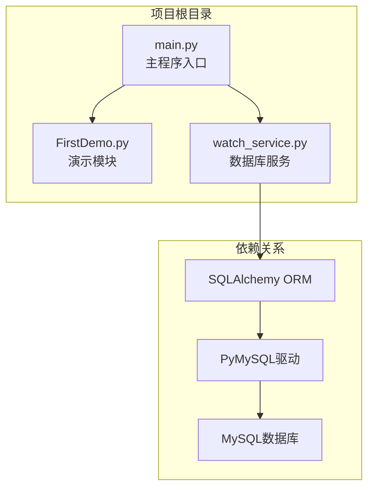
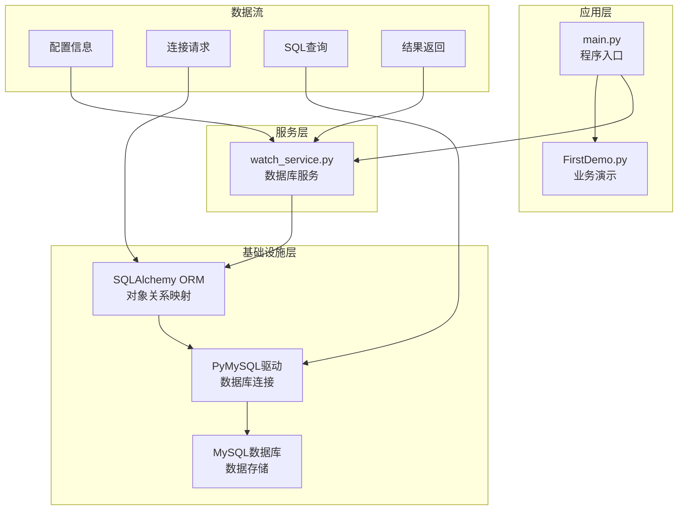
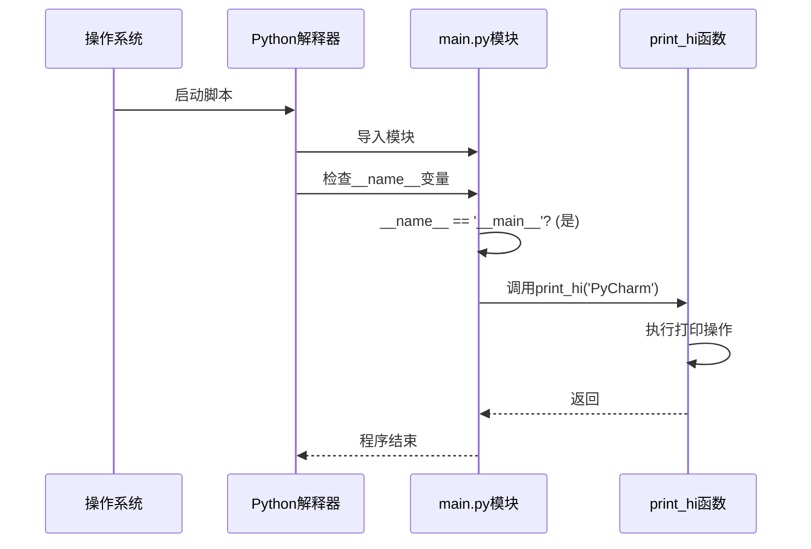
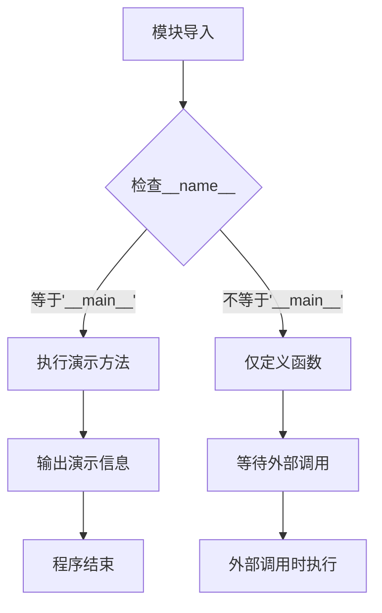
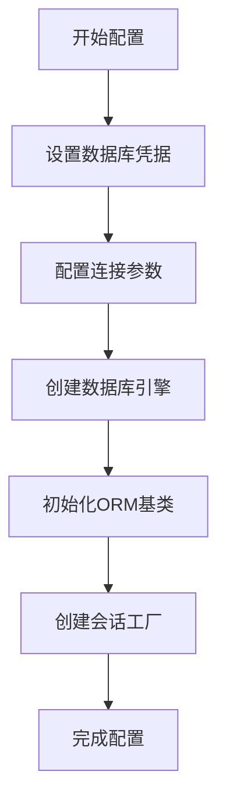
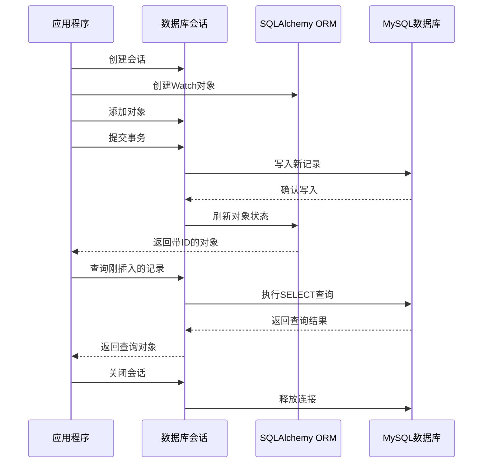
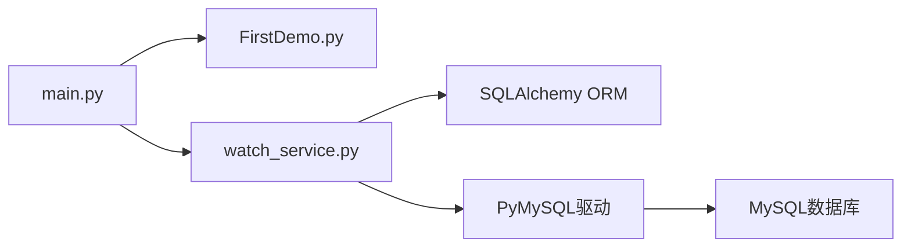

# 核心模块详解

<cite>
**本文档引用的文件**
- [main.py](file://main.py)
- [FirstDemo.py](file://FirstDemo.py)
- [watch_service.py](file://watch_service.py)
</cite>

## 目录
1. [项目概述](#项目概述)
2. [项目结构](#项目结构)
3. [核心组件总览](#核心组件总览)
4. [架构概览](#架构概览)
5. [详细组件分析](#详细组件分析)
6. [模块间依赖关系](#模块间依赖关系)
7. [性能与最佳实践](#性能与最佳实践)
8. [故障排除指南](#故障排除指南)
9. [总结](#总结)

## 项目概述

FirstProject是一个极简的Python项目，包含三个核心模块，展示了基础的Python编程模式、模块化设计和数据库操作实践。该项目采用分层架构设计，通过清晰的模块边界实现了关注点分离，为学习Python开发提供了良好的参考范例。

## 项目结构

项目采用扁平化的文件组织结构，所有核心功能都集中在三个独立的Python文件中：

**图表来源**
- [main.py:1-17](file://main.py#L1-L17)
- [FirstDemo.py:1-11](file://FirstDemo.py#L1-L11)
- [watch_service.py:1-52](file://watch_service.py#L1-L52)

**章节来源**
- [main.py:1-17](file://main.py#L1-L17)
- [FirstDemo.py:1-11](file://FirstDemo.py#L1-L11)
- [watch_service.py:1-52](file://watch_service.py#L1-L52)

## 核心组件总览

本项目包含三个精心设计的核心模块，每个模块都有明确的职责分工：

### 主程序入口模块 (main.py)
- **设计目的**: 提供标准的Python程序入口点和调试支持
- **核心功能**: 包含标准的`__main__`入口点和调试辅助函数
- **实现特点**: 采用简洁的函数定义模式，遵循Python最佳实践

### 演示模块 (FirstDemo.py)
- **设计目的**: 展示Python模块化编程的基本概念
- **核心功能**: 提供两个演示方法，展示函数定义和模块导入模式
- **实现特点**: 包含条件执行逻辑，演示模块的可执行特性

### 数据库服务模块 (watch_service.py)
- **设计目的**: 提供完整的数据库操作流程演示
- **核心功能**: 实现从连接配置到CRUD操作的完整数据流
- **实现特点**: 使用SQLAlchemy ORM进行对象关系映射

**章节来源**
- [main.py:7-14](file://main.py#L7-L14)
- [FirstDemo.py:1-11](file://FirstDemo.py#L1-L11)
- [watch_service.py:1-52](file://watch_service.py#L1-L52)

## 架构概览

项目采用分层架构设计，通过清晰的职责分离实现了模块间的松耦合：

**图表来源**
- [watch_service.py:14-20](file://watch_service.py#L14-L20)
- [watch_service.py:23-28](file://watch_service.py#L23-L28)

## 详细组件分析

### 主程序入口模块 (main.py)

#### 设计目的与实现原理
main.py采用了标准的Python程序入口点模式，通过`if __name__ == '__main__':`机制确保模块既可以被导入使用，也可以直接运行。

#### 函数定义模式
- **print_hi函数**: 接受一个字符串参数，用于输出问候信息
- **调试支持**: 包含断点调试注释，便于开发者调试代码
- **入口点机制**: 标准的Python程序启动方式

#### 程序入口点机制

**图表来源**
- [main.py:13-14](file://main.py#L13-L14)
- [main.py:7-9](file://main.py#L7-L9)

**章节来源**
- [main.py:7-14](file://main.py#L7-L14)

### 演示模块 (FirstDemo.py)

#### 模块化演示功能
FirstDemo.py展示了Python模块化编程的核心概念，包含两个演示方法和条件执行逻辑。

#### 函数调用模式
- **demoMethod**: 基础演示函数，输出欢迎信息
- **demoMethod2**: 扩展演示函数，展示重复调用模式
- **条件执行**: 使用`if __name__ == '__main__':`确保模块可独立运行

#### 模块化设计原则

**图表来源**
- [FirstDemo.py:4-5](file://FirstDemo.py#L4-L5)
- [FirstDemo.py:1-2](file://FirstDemo.py#L1-L2)

**章节来源**
- [FirstDemo.py:1-11](file://FirstDemo.py#L1-L11)

### 数据库服务模块 (watch_service.py)

#### 完整数据库操作流程

##### 连接配置阶段

**图表来源**
- [watch_service.py:6-18](file://watch_service.py#L6-L18)

##### ORM实体映射
Watch实体类严格对应`t_watch`表结构：
- **id字段**: BigInteger类型，主键，自动递增
- **brand字段**: String类型，非空约束
- **model_no字段**: String类型，默认空字符串

##### CRUD操作实现

**图表来源**
- [watch_service.py:33-48](file://watch_service.py#L33-L48)
- [watch_service.py:23-28](file://watch_service.py#L23-L28)

#### 详细操作步骤

**步骤1：会话创建**
- 使用sessionmaker创建数据库会话
- 配置自动提交和自动刷新选项
- 确保事务的显式控制

**步骤2：新增数据**
- 创建Watch实体实例
- 设置品牌和型号属性
- 调用add方法添加到会话
- 执行commit确保持久化
- 使用refresh获取自增ID

**步骤3：本地查询验证**
- 通过主键查询刚插入的记录
- 验证数据完整性
- 输出查询结果

**步骤4：资源清理**
- 显式关闭数据库会话
- 释放数据库连接
- 避免连接泄漏

**章节来源**
- [watch_service.py:23-48](file://watch_service.py#L23-L48)

## 模块间依赖关系

项目采用松耦合设计，模块间依赖关系简单明确：

**图表来源**
- [main.py:13-14](file://main.py#L13-L14)
- [watch_service.py:2-4](file://watch_service.py#L2-L4)

### 依赖分析
- **main.py**: 无外部依赖，仅使用内置功能
- **FirstDemo.py**: 无外部依赖，纯Python标准库
- **watch_service.py**: 依赖SQLAlchemy ORM框架

**章节来源**
- [main.py:1-17](file://main.py#L1-L17)
- [FirstDemo.py:1-11](file://FirstDemo.py#L1-L11)
- [watch_service.py:2-4](file://watch_service.py#L2-L4)

## 性能与最佳实践

### 连接管理优化
- **连接池配置**: 使用`pool_size=0`关闭连接池，避免事务挂起
- **资源清理**: 在finally块中确保会话和引擎正确关闭
- **事务控制**: 显式commit确保数据一致性

### 错误处理策略
- **异常安全**: 使用try-finally确保资源清理
- **连接释放**: 明确的close和dispose调用
- **数据验证**: 本地查询验证确保操作成功

### 性能考虑
- **最小权限原则**: 仅暴露必要的配置参数
- **资源复用**: 会话工厂模式避免重复创建
- **连接复用**: 单次连接处理多个操作

## 故障排除指南

### 常见问题及解决方案

#### 数据库连接失败
**症状**: 程序启动时报数据库连接错误
**原因**: 
- 数据库凭据配置错误
- MySQL服务未启动
- 网络连接问题

**解决方案**:
1. 验证MySQL用户、密码、数据库名配置
2. 确认MySQL服务正常运行
3. 检查网络连通性

#### ORM映射错误
**症状**: 查询或插入操作失败
**原因**:
- 表结构与实体类定义不匹配
- 字段类型配置错误

**解决方案**:
1. 对照数据库表结构检查实体类定义
2. 验证字段类型和约束条件
3. 确认表名配置正确

#### 资源泄漏问题
**症状**: 程序运行时间长后出现内存或连接问题
**原因**: 会话或引擎未正确关闭

**解决方案**:
1. 确保在finally块中调用close()
2. 使用engine.dispose()释放连接池
3. 避免在循环中创建过多会话

**章节来源**
- [watch_service.py:45-52](file://watch_service.py#L45-L52)

## 总结

FirstProject项目通过三个精心设计的模块，为Python开发者提供了完整的入门级参考案例。每个模块都体现了特定的设计原则和最佳实践：

- **main.py** 展示了标准的Python程序入口点模式
- **FirstDemo.py** 演示了模块化编程和条件执行
- **watch_service.py** 提供了完整的数据库操作流程

项目采用分层架构设计，通过清晰的职责分离实现了模块间的松耦合。SQLAlchemy ORM的使用确保了代码的可维护性和扩展性。严格的资源管理和错误处理机制保证了系统的稳定性和可靠性。

这个项目为学习Python开发提供了良好的起点，涵盖了从基础语法到高级特性的各个方面，适合不同层次的开发者学习和参考。