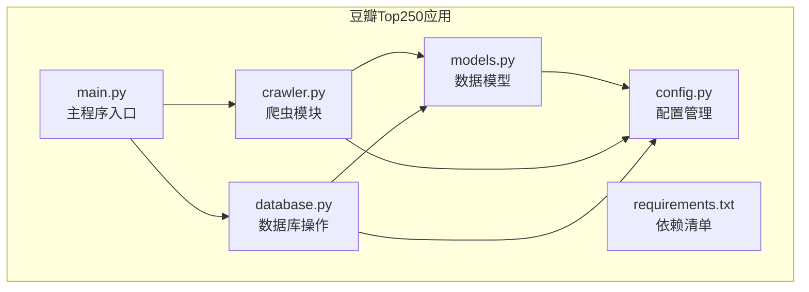
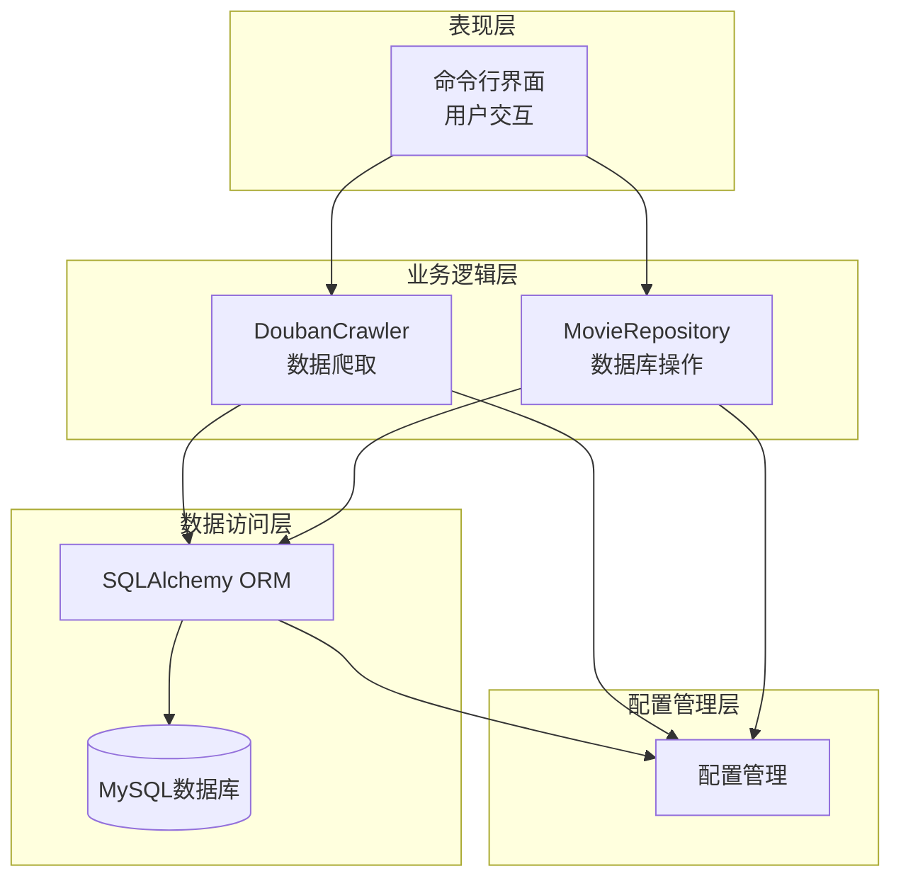
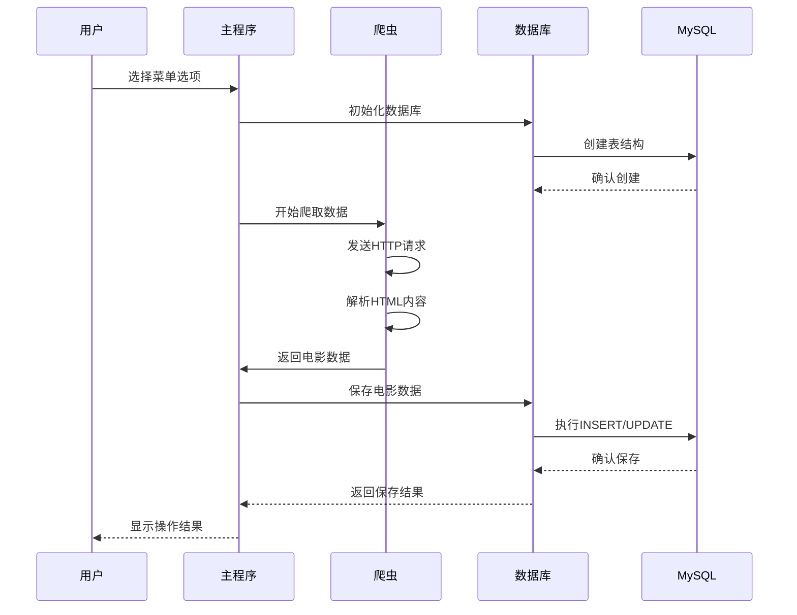
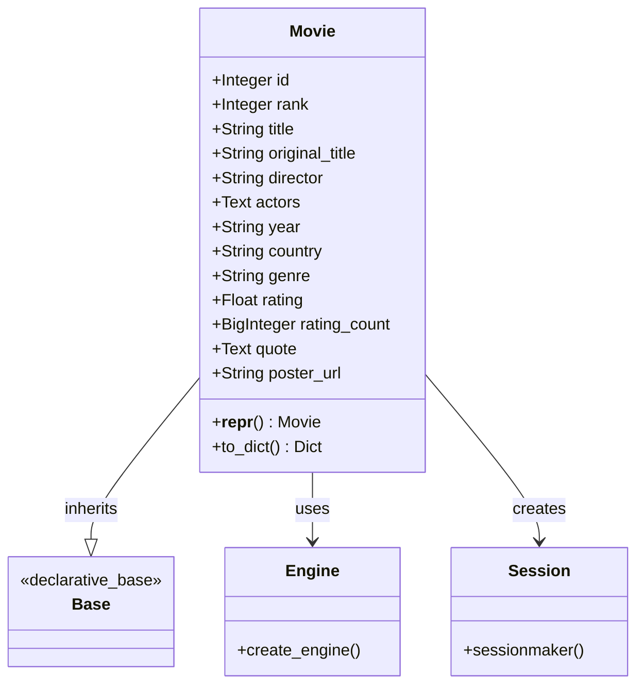
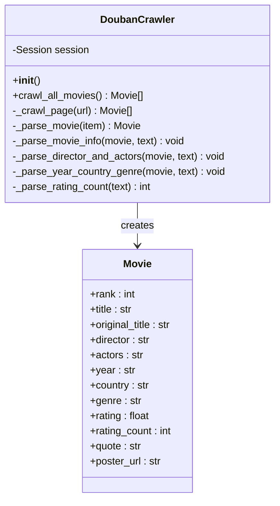
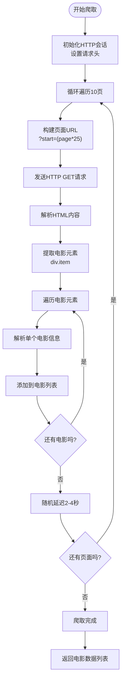
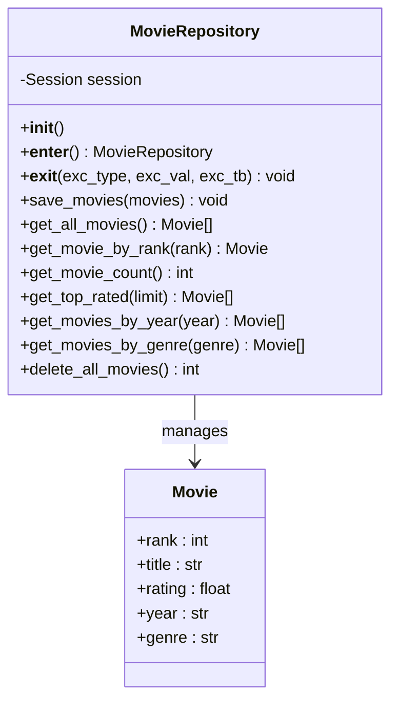
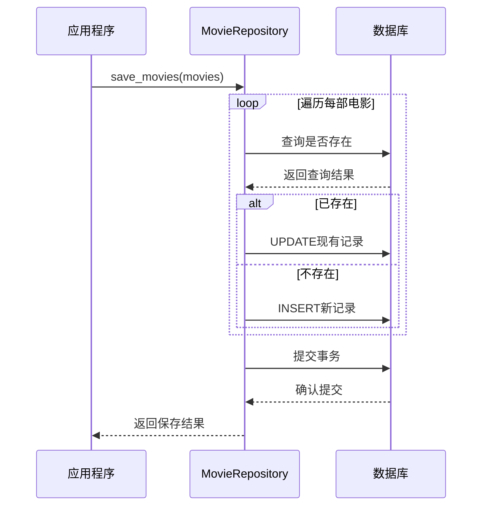
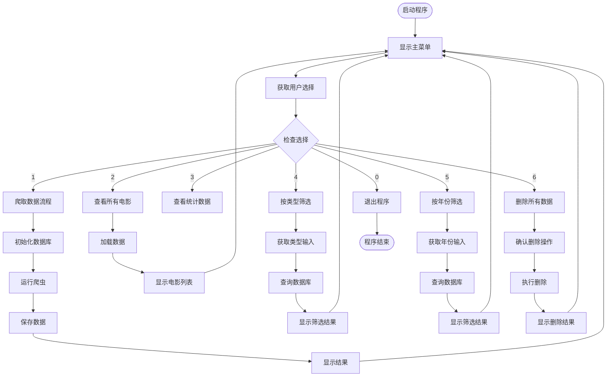
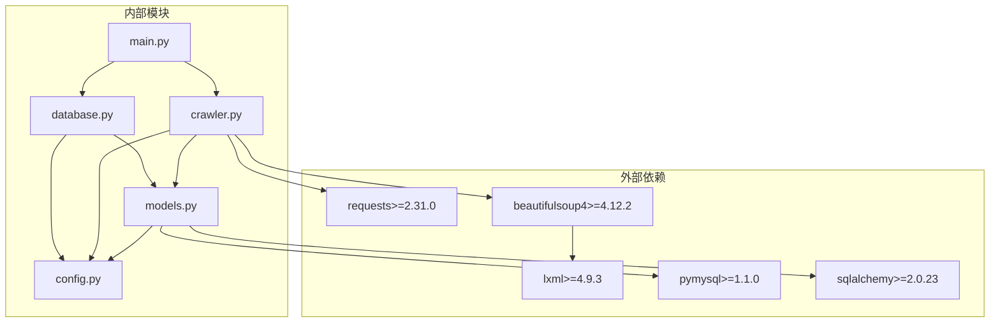

# 豆瓣Top250爬虫应用

<cite>
**本文档引用的文件**
- [config.py](file://douban_top250/config.py)
- [crawler.py](file://douban_top250/crawler.py)
- [database.py](file://douban_top250/database.py)
- [main.py](file://douban_top250/main.py)
- [models.py](file://douban_top250/models.py)
- [requirements.txt](file://douban_top250/requirements.txt)
- [repowiki.md](file://douban_top250/repowiki.md)
</cite>

## 目录
1. [项目概述](#项目概述)
2. [项目结构](#项目结构)
3. [核心组件](#核心组件)
4. [架构概览](#架构概览)
5. [详细组件分析](#详细组件分析)
6. [依赖关系分析](#依赖关系分析)
7. [性能考虑](#性能考虑)
8. [故障排除指南](#故障排除指南)
9. [结论](#结论)

## 项目概述

豆瓣Top250爬虫应用是一个基于Python的Web爬虫系统，专门用于从豆瓣电影Top250页面抓取电影信息，并通过SQLAlchemy ORM框架将数据持久化存储到MySQL数据库中。该应用采用模块化设计，提供了完整的数据采集、存储、查询和展示功能。

**主要技术栈**：
- Python 3.x
- requests + BeautifulSoup4：网页抓取和HTML解析
- SQLAlchemy：ORM框架和数据库操作
- MySQL：数据存储

**核心功能**：
- 自动爬取豆瓣电影Top250全部数据（10页，250部电影）
- 智能防封机制（随机2-4秒请求延迟）
- 数据持久化和增量更新
- 交互式命令行界面
- 多维度数据查询和筛选

## 项目结构

该项目采用清晰的模块化组织结构，每个模块都有明确的职责分工：



**图表来源**
- [main.py:1-176](file://douban_top250/main.py#L1-L176)
- [crawler.py:1-202](file://douban_top250/crawler.py#L1-L202)
- [database.py:1-136](file://douban_top250/database.py#L1-L136)
- [models.py:1-71](file://douban_top250/models.py#L1-L71)
- [config.py:1-38](file://douban_top250/config.py#L1-L38)

**章节来源**
- [repowiki.md:21-32](file://douban_top250/repowiki.md#L21-L32)
- [requirements.txt:1-6](file://douban_top250/requirements.txt#L1-L6)

## 核心组件

### 数据模型层

数据模型层使用SQLAlchemy ORM框架定义Movie实体类，实现了与MySQL数据库的映射关系。该层负责数据结构定义、数据库表创建和数据序列化。

**关键特性**：
- 完整的电影信息字段定义
- 数据库表结构自动创建
- 对象关系映射（ORM）
- 字典格式数据转换

### 爬虫层

爬虫层实现了DoubanCrawler类，负责从豆瓣电影Top250页面抓取数据。该层处理HTTP请求、HTML解析和数据提取。

**核心功能**：
- 分页数据抓取（10页，每页25部电影）
- 智能防封机制（随机延迟）
- 多层次HTML元素解析
- 错误处理和异常恢复

### 数据库操作层

数据库操作层通过MovieRepository类封装了所有数据库操作，包括CRUD操作、查询方法和事务管理。

**主要方法**：
- 批量保存和更新电影数据
- 多维度查询（按评分、年份、类型）
- 统计信息查询
- 数据清理和删除

### 主程序层

主程序层提供了完整的命令行交互界面，集成了所有功能模块，用户可以通过菜单进行各种操作。

**菜单功能**：
- 数据爬取和保存
- 数据查询和展示
- 统计信息查看
- 数据筛选功能
- 数据清理操作

**章节来源**
- [models.py:15-53](file://douban_top250/models.py#L15-L53)
- [crawler.py:16-132](file://douban_top250/crawler.py#L16-L132)
- [database.py:11-130](file://douban_top250/database.py#L11-L130)
- [main.py:17-167](file://douban_top250/main.py#L17-L167)

## 架构概览

该应用采用经典的三层架构模式，各层职责明确，耦合度低，便于维护和扩展。



**图表来源**
- [main.py:142-167](file://douban_top250/main.py#L142-L167)
- [crawler.py:19-52](file://douban_top250/crawler.py#L19-L52)
- [database.py:14-25](file://douban_top250/database.py#L14-L25)
- [models.py:55-71](file://douban_top250/models.py#L55-L71)

### 数据流图



**图表来源**
- [main.py:32-50](file://douban_top250/main.py#L32-L50)
- [crawler.py:23-52](file://douban_top250/crawler.py#L23-L52)
- [database.py:27-57](file://douban_top250/database.py#L27-L57)

## 详细组件分析

### 配置管理模块

配置管理模块集中管理应用程序的所有配置参数，包括数据库连接信息和爬虫设置。

**配置参数说明**：

| 参数名称 | 类型 | 默认值 | 说明 |
|---------|------|--------|------|
| MYSQL_HOST | 字符串 | localhost | MySQL服务器地址 |
| MYSQL_PORT | 整数 | 3306 | MySQL端口号 |
| MYSQL_USER | 字符串 | root | MySQL用户名 |
| MYSQL_PASSWORD | 字符串 | 空 | MySQL密码 |
| MYSQL_DATABASE | 字符串 | douban | 数据库名 |
| BASE_URL | 字符串 | https://movie.douban.com/top250 | 豆瓣Top250基础URL |
| PAGE_SIZE | 整数 | 25 | 每页电影数量 |
| TOTAL_PAGES | 整数 | 10 | 总页数 |
| REQUEST_DELAY | 元组 | (2, 4) | 请求间隔（秒） |

**章节来源**
- [config.py:7-38](file://douban_top250/config.py#L7-L38)

### 数据模型设计

数据模型层使用SQLAlchemy定义了完整的Movie实体类，实现了与MySQL数据库的映射关系。



**图表来源**
- [models.py:15-53](file://douban_top250/models.py#L15-L53)
- [models.py:55-71](file://douban_top250/models.py#L55-L71)

**数据模型字段详解**：

| 字段名 | 数据类型 | 约束条件 | 说明 |
|--------|----------|----------|------|
| id | Integer | 主键，自增 | 唯一标识符 |
| rank | Integer | 唯一，非空 | 电影排名 |
| title | String(255) | 非空 | 电影中文名称 |
| original_title | String(255) | 可空 | 电影原名 |
| director | String(255) | 可空 | 导演姓名 |
| actors | Text | 可空 | 主演列表 |
| year | String(20) | 可空 | 上映年份 |
| country | String(100) | 可空 | 制片国家/地区 |
| genre | String(100) | 可空 | 电影类型 |
| rating | Float | 可空 | 电影评分 |
| rating_count | BigInteger | 可空 | 评价人数 |
| quote | Text | 可空 | 经典台词 |
| poster_url | String(500) | 可空 | 海报图片URL |

**章节来源**
- [models.py:15-53](file://douban_top250/models.py#L15-L53)

### 爬虫模块实现

爬虫模块实现了DoubanCrawler类，负责从豆瓣电影Top250页面抓取数据。该实现采用了面向对象的设计模式，具有良好的可维护性和扩展性。



**图表来源**
- [crawler.py:16-132](file://douban_top250/crawler.py#L16-L132)
- [models.py:15-35](file://douban_top250/models.py#L15-L35)

**爬取流程分析**：



**图表来源**
- [crawler.py:23-52](file://douban_top250/crawler.py#L23-L52)
- [crawler.py:54-79](file://douban_top250/crawler.py#L54-L79)

**数据解析算法**：

爬虫模块实现了复杂的HTML解析算法，能够准确提取电影的各种信息：

1. **排名解析**：从`<em>`标签中提取数字排名
2. **标题解析**：从`<span class="title">`中提取中文标题和原名
3. **海报解析**：从``标签中提取图片URL
4. **导演演员解析**：从第一行文本中分离导演和主演信息
5. **年份国家类型解析**：从第二行文本中分割年份、国家、类型
6. **评分解析**：从`<span class="rating_num">`中提取评分
7. **评价人数解析**：使用正则表达式提取数字
8. **经典台词解析**：从`<span class="inq">`中提取

**章节来源**
- [crawler.py:54-132](file://douban_top250/crawler.py#L54-L132)

### 数据库操作模块

数据库操作模块通过MovieRepository类封装了所有数据库操作，提供了完整的CRUD功能和高级查询能力。



**图表来源**
- [database.py:11-130](file://douban_top250/database.py#L11-L130)
- [models.py:15-35](file://douban_top250/models.py#L15-L35)

**批量操作流程**：



**图表来源**
- [database.py:27-57](file://douban_top250/database.py#L27-L57)

**查询方法分析**：

数据库模块提供了多种查询方法，满足不同的数据检索需求：

1. **全量查询**：`get_all_movies()` - 获取所有电影，按排名排序
2. **条件查询**：`get_movie_by_rank(rank)` - 根据排名精确查询
3. **统计查询**：`get_movie_count()` - 获取电影总数
4. **排序查询**：`get_top_rated(limit)` - 获取评分最高的电影
5. **范围查询**：`get_movies_by_year(year)` - 按年份范围查询
6. **模糊查询**：`get_movies_by_genre(genre)` - 按类型模糊查询

**章节来源**
- [database.py:27-130](file://douban_top250/database.py#L27-L130)

### 主程序交互界面

主程序提供了完整的命令行交互界面，用户可以通过菜单进行各种操作。

**菜单功能流程**：



**图表来源**
- [main.py:17-167](file://douban_top250/main.py#L17-L167)

**错误处理机制**：

主程序实现了完善的错误处理机制，包括：

1. **键盘中断处理**：捕获Ctrl+C信号
2. **异常捕获**：捕获所有未处理异常
3. **用户输入验证**：验证菜单选择的有效性
4. **数据库连接检查**：确保数据库可用性
5. **网络请求异常**：处理HTTP请求失败

**章节来源**
- [main.py:17-176](file://douban_top250/main.py#L17-L176)

## 依赖关系分析

项目依赖关系清晰明确，各模块之间的耦合度适中，便于维护和扩展。



**图表来源**
- [requirements.txt:1-6](file://douban_top250/requirements.txt#L1-L6)
- [main.py:13-14](file://douban_top250/main.py#L13-L14)
- [crawler.py:10-13](file://douban_top250/crawler.py#L10-L13)
- [database.py:7-8](file://douban_top250/database.py#L7-L8)
- [models.py:7-10](file://douban_top250/models.py#L7-L10)

**依赖关系特点**：

1. **单向依赖**：外部依赖只影响内部模块，内部模块之间相互独立
2. **松耦合**：通过配置文件和接口实现模块间的解耦
3. **可替换性**：底层依赖可以替换而不影响上层逻辑
4. **版本兼容**：使用版本范围确保兼容性

**章节来源**
- [requirements.txt:1-6](file://douban_top250/requirements.txt#L1-L6)

## 性能考虑

### 网络请求优化

应用实现了智能的请求频率控制，避免过于频繁的请求导致被豆瓣反爬虫机制拦截。

**性能优化措施**：
- 随机延迟机制（2-4秒）
- HTTP会话复用
- 超时控制（30秒）
- 错误重试机制

### 数据库性能优化

通过合理的数据库设计和查询优化，确保数据操作的高效性。

**优化策略**：
- 唯一键约束（rank字段）
- 索引优化（按rank排序）
- 批量操作减少数据库往返
- 连接池管理

### 内存管理

应用采用流式处理和分批操作，避免大量数据同时占用内存。

**内存优化**：
- 分页爬取（每页25部）
- 渐进式数据处理
- 及时释放资源

## 故障排除指南

### 常见问题及解决方案

**1. 数据库连接失败**
- 检查MySQL服务状态
- 验证用户名和密码
- 确认数据库存在
- 检查防火墙设置

**2. 网络请求超时**
- 检查网络连接
- 增加超时时间
- 验证代理设置
- 检查目标网站状态

**3. HTML解析失败**
- 检查BeautifulSoup安装
- 验证lxml解析器
- 检查网页结构变化
- 更新解析规则

**4. 权限不足**
- 检查MySQL权限
- 验证数据库用户权限
- 确认表创建权限

### 调试技巧

**启用SQLAlchemy日志**：
```python
# 在models.py中设置echo=True
engine = create_engine(DATABASE_URL, pool_pre_ping=True, echo=True)
```

**增加调试输出**：
```python
# 在config.py中设置更详细的日志
DEBUG = True
```

**章节来源**
- [repowiki.md:207-213](file://douban_top250/repowiki.md#L207-L213)

## 结论

豆瓣Top250爬虫应用是一个设计良好、实现完整的Web爬虫系统。该应用展现了以下优秀特性：

**架构优势**：
- 清晰的模块化设计
- 良好的分层架构
- 适当的抽象层次
- 明确的职责分工

**技术亮点**：
- 智能的反爬虫策略
- 完善的数据持久化
- 丰富的查询功能
- 用户友好的交互界面

**扩展性**：
- 易于添加新的查询条件
- 支持数据导出功能
- 可扩展的配置管理
- 模块化的代码结构

该应用不仅实现了预期的功能需求，还提供了良好的用户体验和维护性，是一个值得学习和参考的Python爬虫项目实现。