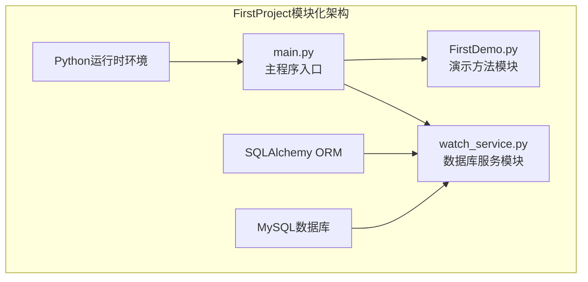
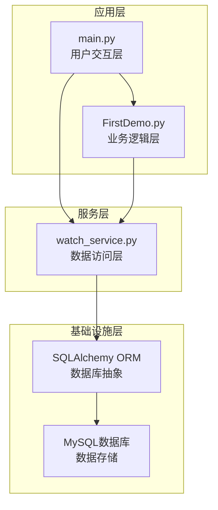
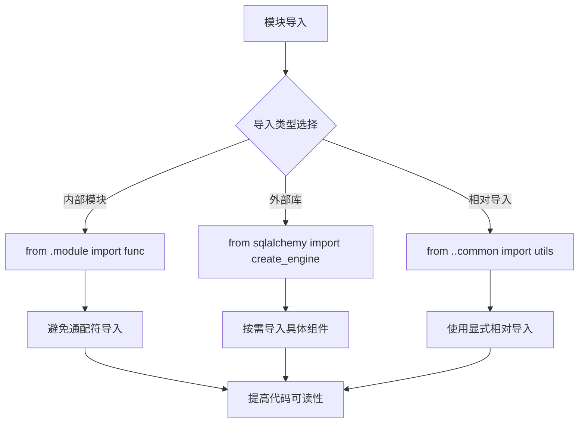
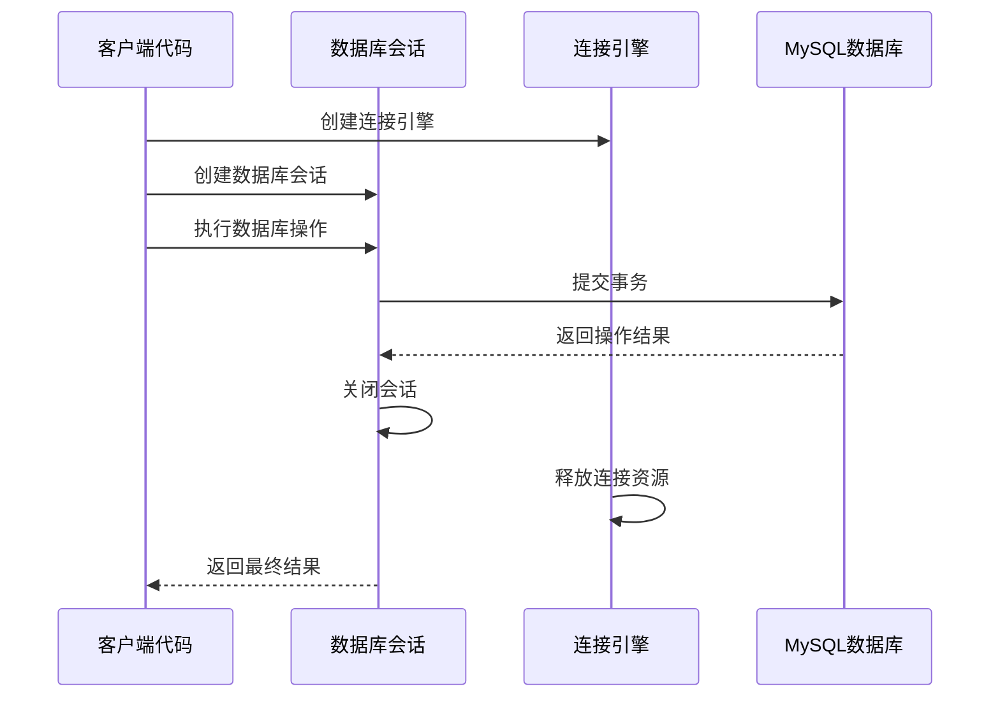
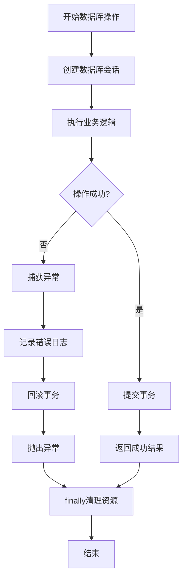
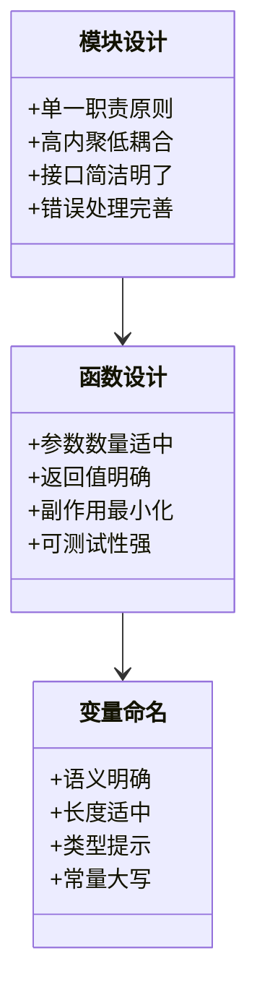
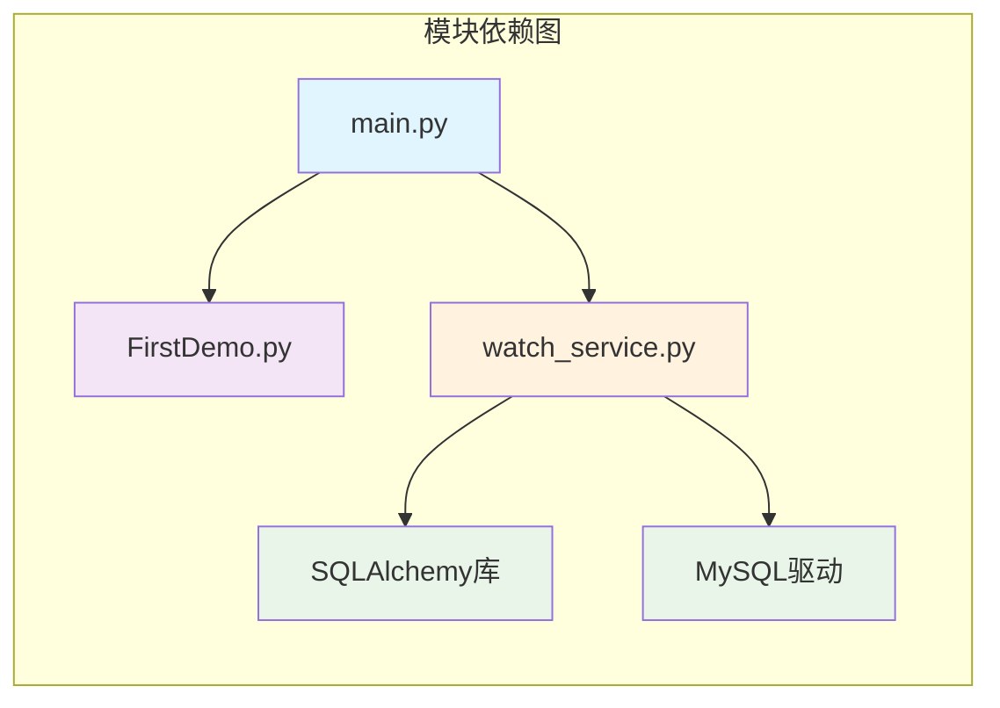

# 模块化开发实践

<cite>
**本文档引用的文件**
- [FirstDemo.py](file://FirstDemo.py)
- [main.py](file://main.py)
- [watch_service.py](file://watch_service.py)
</cite>

## 目录
1. [简介](#简介)
2. [项目结构](#项目结构)
3. [核心组件](#核心组件)
4. [架构概览](#架构概览)
5. [详细组件分析](#详细组件分析)
6. [依赖关系分析](#依赖关系分析)
7. [性能考虑](#性能考虑)
8. [故障排除指南](#故障排除指南)
9. [结论](#结论)
10. [附录](#附录)

## 简介

本指南基于FirstProject项目的实际代码结构，系统性地阐述Python模块化开发的最佳实践。通过分析三个核心模块的实现方式，我们将深入探讨Python模块导入机制、命名空间管理、模块发现规则，以及如何在实际项目中应用职责分离的设计原则。

FirstProject项目虽然规模较小，但包含了模块化开发的核心要素：清晰的模块边界、合理的职责划分、完善的异常处理机制，以及规范的资源管理策略。这些实践为构建大型Python应用程序奠定了坚实基础。

## 项目结构

FirstProject采用极简的模块化架构，包含三个独立的Python模块，每个模块都有明确的职责分工：

**图表来源**
- [main.py:1-17](file://main.py#L1-L17)
- [FirstDemo.py:1-11](file://FirstDemo.py#L1-L11)
- [watch_service.py:1-52](file://watch_service.py#L1-L52)

项目采用扁平化的文件组织结构，所有模块位于同一目录下，便于模块发现和导入。这种结构适合小型到中型项目的初始开发阶段。

**章节来源**
- [main.py:1-17](file://main.py#L1-L17)
- [FirstDemo.py:1-11](file://FirstDemo.py#L1-L11)
- [watch_service.py:1-52](file://watch_service.py#L1-L52)

## 核心组件

### 主程序入口模块

main.py作为整个应用程序的入口点，展示了标准的Python模块设计模式：

- **入口点保护**：使用`if __name__ == '__main__':`确保模块可被导入而不执行主逻辑
- **函数封装**：将主要逻辑封装在可重用的函数中
- **调试支持**：提供了完整的IDE调试配置说明

### 演示方法模块

FirstDemo.py演示了Python模块的基本结构和最佳实践：

- **函数定义**：清晰的方法定义和调用约定
- **模块保护**：同样使用入口点保护机制
- **重复方法**：展示了如何在同一模块中定义多个独立方法

### 数据库服务模块

watch_service.py是项目中最复杂的模块，实现了完整的数据库操作流程：

- **配置管理**：集中式的数据库配置参数
- **ORM映射**：使用SQLAlchemy进行对象关系映射
- **事务管理**：严格的事务控制和资源清理
- **异常处理**：完善的try-finally结构确保资源释放

**章节来源**
- [main.py:7-14](file://main.py#L7-L14)
- [FirstDemo.py:1-11](file://FirstDemo.py#L1-L11)
- [watch_service.py:1-52](file://watch_service.py#L1-L52)

## 架构概览

FirstProject采用了分层架构设计，每个模块承担特定的职责：

**图表来源**
- [main.py:13-14](file://main.py#L13-L14)
- [watch_service.py:23-28](file://watch_service.py#L23-L28)

该架构体现了单一职责原则：main.py负责用户交互，FirstDemo.py提供业务逻辑，watch_service.py专门处理数据访问。这种分离使得每个模块都相对简单且易于维护。

## 详细组件分析

### 模块导入机制分析

Python的模块导入机制是实现模块化开发的基础。通过分析FirstProject中的模块使用方式，我们可以总结出以下最佳实践：

#### 导入策略

**图表来源**
- [watch_service.py:2-4](file://watch_service.py#L2-L4)

#### 命名空间管理

每个Python模块都有自己的命名空间，通过以下方式管理：

- **模块级变量**：全局配置参数
- **函数级变量**：局部作用域的临时数据
- **类级变量**：面向对象的属性定义

#### 模块发现规则

Python遵循以下模块发现顺序：
1. 内置模块（如os、sys）
2. 标准库模块
3. 第三方库模块
4. 当前包内的模块
5. 父包内的模块

**章节来源**
- [watch_service.py:6-11](file://watch_service.py#L6-L11)
- [watch_service.py:14-18](file://watch_service.py#L14-L18)

### 资源管理最佳实践

watch_service.py展示了完整的资源管理生命周期：

**图表来源**
- [watch_service.py:33-48](file://watch_service.py#L33-L48)

#### 数据库连接管理

关键的资源管理策略包括：

- **连接池配置**：通过`pool_size=0`和`max_overflow=-1`禁用连接池，避免事务挂起
- **事务控制**：使用单点提交确保数据一致性
- **资源清理**：在finally块中强制关闭会话和释放连接
- **异常安全**：即使发生异常也能确保资源正确释放

**章节来源**
- [watch_service.py:14-18](file://watch_service.py#L14-L18)
- [watch_service.py:33-48](file://watch_service.py#L33-L48)

### 异常处理策略

异常处理是模块化开发的重要组成部分。watch_service.py展示了健壮的异常处理模式：

**图表来源**
- [watch_service.py:33-48](file://watch_service.py#L33-L48)

#### 错误恢复机制

- **自动回滚**：异常发生时自动回滚未提交的事务
- **资源清理**：确保无论成功与否都能正确释放资源
- **错误传播**：将底层异常转换为有意义的应用层错误信息

**章节来源**
- [watch_service.py:33-48](file://watch_service.py#L33-L48)

### 代码组织原则

#### 函数设计原则

**图表来源**
- [FirstDemo.py:1-11](file://FirstDemo.py#L1-L11)
- [main.py:7-9](file://main.py#L7-L9)

#### 命名规范

- **模块名称**：使用小写字母和下划线，描述模块功能
- **函数名称**：使用动词短语，清晰表达函数意图
- **变量名称**：使用名词短语，避免缩写
- **常量名称**：使用全大写字母，单词间下划线分隔

**章节来源**
- [FirstDemo.py:1-11](file://FirstDemo.py#L1-L11)
- [main.py:7-9](file://main.py#L7-L9)

### 文档注释最佳实践

良好的文档注释是模块化开发质量的重要体现。建议采用以下格式：

- **模块级注释**：描述模块的整体功能和使用场景
- **函数级注释**：说明函数参数、返回值和异常情况
- **复杂逻辑注释**：解释算法思路和关键决策点
- **配置参数注释**：详细说明每个配置项的作用和取值范围

## 依赖关系分析

FirstProject的模块依赖关系相对简单，体现了良好的模块解耦：

**图表来源**
- [main.py:13-14](file://main.py#L13-L14)
- [watch_service.py:2-4](file://watch_service.py#L2-L4)

### 依赖管理策略

- **显式导入**：所有外部依赖都在模块顶部明确声明
- **版本兼容**：确保第三方库版本与项目需求匹配
- **循环依赖避免**：通过重构消除模块间的循环引用

**章节来源**
- [watch_service.py:2-4](file://watch_service.py#L2-L4)

## 性能考虑

### 模块加载优化

- **延迟导入**：对于不常用的模块，考虑使用延迟导入减少启动时间
- **缓存策略**：对频繁使用的计算结果进行缓存
- **内存管理**：及时释放不再使用的对象引用

### 资源使用效率

- **连接复用**：在需要时启用连接池以提高数据库访问效率
- **批量操作**：合并多个小操作为批量操作减少网络往返
- **异步处理**：对于I/O密集型操作考虑使用异步编程模型

## 故障排除指南

### 常见问题诊断

#### 模块导入错误

**症状**：`ModuleNotFoundError`或`ImportError`

**解决方案**：
- 检查PYTHONPATH环境变量设置
- 确认模块文件路径正确
- 验证模块文件具有正确的权限

#### 数据库连接问题

**症状**：连接超时、认证失败、连接池耗尽

**解决方案**：
- 检查数据库服务器状态
- 验证连接参数配置
- 调整连接池参数设置
- 实施连接健康检查机制

#### 资源泄漏问题

**症状**：内存占用持续增长、文件句柄耗尽

**解决方案**：
- 确保所有资源都在finally块中清理
- 使用上下文管理器确保资源正确释放
- 实施资源使用监控和告警机制

**章节来源**
- [watch_service.py:45-48](file://watch_service.py#L45-L48)

## 结论

FirstProject项目虽然规模不大，但充分体现了Python模块化开发的核心原则。通过合理的设计和实现，我们可以在保持代码简洁的同时，确保系统的可维护性和可扩展性。

模块化开发的关键在于：
- 明确的职责分离
- 清晰的接口设计  
- 完善的异常处理
- 规范的资源管理
- 良好的文档注释

这些原则不仅适用于当前项目，也为更大规模的Python应用程序开发提供了坚实的基础。

## 附录

### 扩展新模块的指导原则

#### 模块设计步骤

1. **需求分析**：明确模块的功能边界和预期行为
2. **接口设计**：定义清晰的公共接口和数据结构
3. **错误处理**：设计完整的异常处理和错误恢复机制
4. **资源管理**：制定资源分配和释放策略
5. **测试计划**：编写单元测试和集成测试方案

#### 代码审查清单

- [ ] 是否遵循单一职责原则
- [ ] 接口设计是否简洁明了
- [ ] 是否有适当的错误处理
- [ ] 资源管理是否完善
- [ ] 是否有充分的文档注释
- [ ] 是否通过了单元测试
- [ ] 是否考虑了性能影响

#### 最佳实践总结

- 保持模块的独立性和完整性
- 使用清晰的命名约定
- 实现一致的错误处理模式
- 确保资源的正确管理和释放
- 编写高质量的文档和测试