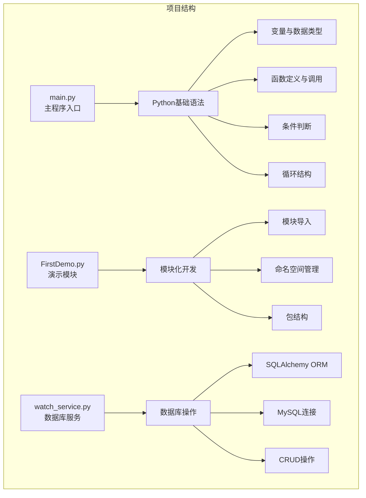
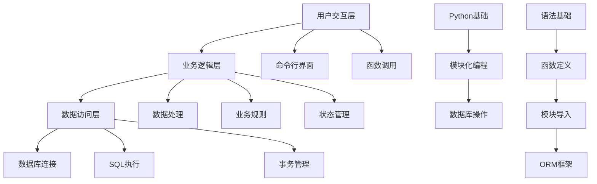
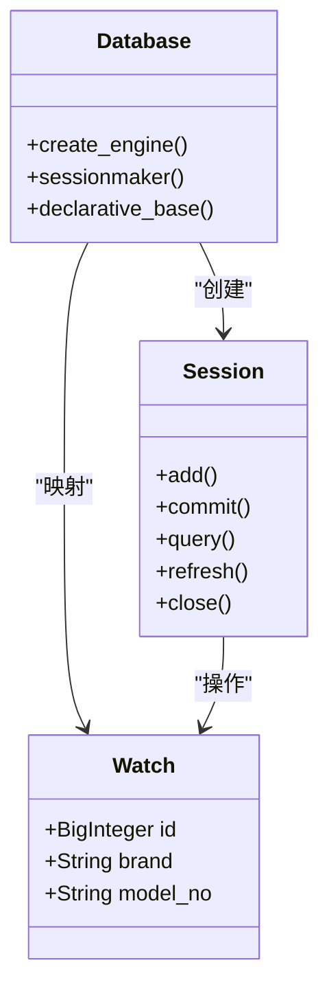
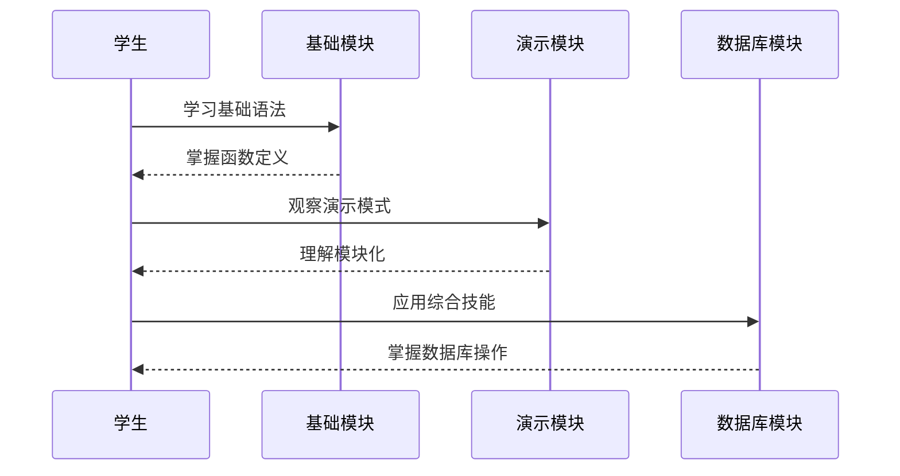
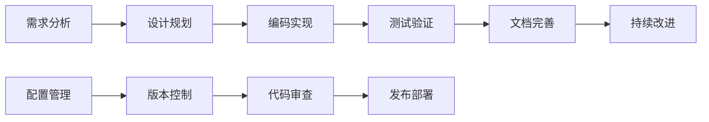

# 项目概述

<cite>
**本文档引用的文件**
- [FirstDemo.py](file://FirstDemo.py)
- [main.py](file://main.py)
- [watch_service.py](file://watch_service.py)
</cite>

## 目录
1. [项目简介](#项目简介)
2. [项目结构](#项目结构)
3. [核心组件](#核心组件)
4. [架构概览](#架构概览)
5. [详细组件分析](#详细组件分析)
6. [教学设计理念](#教学设计理念)
7. [学习路径设计](#学习路径设计)
8. [技术栈选择](#技术栈选择)
9. [最佳实践总结](#最佳实践总结)
10. [结语](#结语)

## 项目简介

FirstProject是一个极简的Python演示项目，专为Python编程初学者设计。该项目通过三个精心设计的核心模块，展示了Python基础编程、模块化开发和数据库操作的最佳实践。项目采用渐进式教学方法，从最简单的函数调用开始，逐步深入到完整的数据库操作流程，帮助开发者建立扎实的编程基础。

该项目的独特价值在于其极简而实用的设计理念：每个模块都专注于一个核心概念，代码简洁明了，注释详细，便于初学者理解和模仿。通过实际的数据库操作示例，学生可以直观地看到Python编程在真实场景中的应用价值。

## 项目结构

项目采用极简的三层架构设计，每个文件都是一个独立的功能模块：

**图表来源**
- [main.py:1-17](file://main.py#L1-L17)
- [FirstDemo.py:1-11](file://FirstDemo.py#L1-L11)
- [watch_service.py:1-52](file://watch_service.py#L1-L52)

**章节来源**
- [main.py:1-17](file://main.py#L1-L17)
- [FirstDemo.py:1-11](file://FirstDemo.py#L1-L11)
- [watch_service.py:1-52](file://watch_service.py#L1-L52)

## 核心组件

### 主程序入口模块 (main.py)

这是标准的Python程序入口点，展示了最基本的程序结构和调试技巧。该模块包含了：
- 函数定义和参数传递
- 条件执行逻辑 (`if __name__ == '__main__':`)
- 注释和调试断点的使用
- IDE集成开发环境的使用指导

### 演示模块 (FirstDemo.py)

专门用于演示Python基础功能的模块，包含两个演示方法：
- 基础函数调用和字符串输出
- 多次重复输出的演示
- 模块独立运行和导入使用的区别

### 数据库服务模块 (watch_service.py)

这是项目的核心模块，展示了完整的数据库操作流程：
- SQLAlchemy ORM框架的使用
- MySQL数据库连接配置
- 数据模型定义和映射
- 完整的CRUD操作流程

**章节来源**
- [main.py:7-14](file://main.py#L7-L14)
- [FirstDemo.py:1-11](file://FirstDemo.py#L1-L11)
- [watch_service.py:22-48](file://watch_service.py#L22-L48)

## 架构概览

项目采用分层架构设计，体现了从简单到复杂的渐进式学习路径：

**图表来源**
- [main.py:13-14](file://main.py#L13-L14)
- [FirstDemo.py:4-5](file://FirstDemo.py#L4-L5)
- [watch_service.py:14-18](file://watch_service.py#L14-L18)

## 详细组件分析

### Python基础语法模块

#### 变量与数据类型
项目中的所有模块都展示了Python的基本数据类型使用，包括字符串、数字等基础类型。

#### 函数定义与调用
- `print_hi()` 函数展示了参数传递和格式化字符串的使用
- `demoMethod()` 和 `demoMethod2()` 展示了函数定义和调用的基本语法
- 参数传递和返回值处理

#### 条件执行逻辑
- `if __name__ == '__main__':` 结构展示了模块独立运行和导入使用的区别
- 条件判断和分支控制

**章节来源**
- [main.py:7-9](file://main.py#L7-L9)
- [FirstDemo.py:1-2](file://FirstDemo.py#L1-L2)
- [FirstDemo.py:7-8](file://FirstDemo.py#L7-L8)

### 模块化开发模块

#### 模块导入机制
项目展示了如何在Python中组织和导入模块，包括：
- 模块的独立运行能力
- 导入其他模块的语法
- 命名空间的隔离和管理

#### 包结构设计
虽然当前项目只有三个文件，但已经体现了Python包的基本概念：
- 每个文件作为一个独立的模块
- 清晰的功能分离
- 可重用的代码结构

**章节来源**
- [FirstDemo.py:4-5](file://FirstDemo.py#L4-L5)
- [main.py:13-14](file://main.py#L13-L14)

### 数据库操作模块

#### SQLAlchemy ORM框架
项目使用SQLAlchemy作为ORM框架，展示了现代Python数据库操作的最佳实践：
- 数据库引擎配置和连接池管理
- 声明式模型定义
- 会话管理和事务控制

#### 数据模型映射

**图表来源**
- [watch_service.py:23-28](file://watch_service.py#L23-L28)
- [watch_service.py:19-20](file://watch_service.py#L19-L20)

#### CRUD操作流程
项目实现了完整的数据操作流程：
- **创建 (Create)**: 新增手表记录
- **读取 (Read)**: 查询验证新增的数据
- **更新 (Update)**: 通过ORM框架自动处理
- **删除 (Delete)**: 通过ORM框架自动处理

**章节来源**
- [watch_service.py:33-48](file://watch_service.py#L33-L48)
- [watch_service.py:22-28](file://watch_service.py#L22-L28)

## 教学设计理念

### 渐进式学习路径

项目遵循"从简单到复杂"的教学原则，设计了清晰的学习路径：

### 实践导向的教学方法

- **动手实践**: 每个概念都有对应的代码示例
- **即时反馈**: 通过打印输出验证学习效果
- **错误预防**: 提供详细的配置说明和错误处理
- **扩展练习**: 鼓励学生修改参数和添加新功能

### 循序渐进的知识结构

1. **语法基础** (main.py): 变量、函数、条件判断
2. **模块化概念** (FirstDemo.py): 模块导入、命名空间
3. **数据库应用** (watch_service.py): ORM、CRUD操作

## 学习路径设计

### 第一阶段：Python基础语法

**学习目标**:
- 理解Python基本语法结构
- 掌握函数定义和调用
- 学会使用条件执行逻辑

**关键概念**:
- 变量赋值和数据类型
- 函数定义和参数传递
- 条件判断和分支控制
- 字符串格式化输出

### 第二阶段：模块化开发

**学习目标**:
- 理解Python模块的概念和作用
- 掌握模块导入和使用
- 学会编写可重用的代码

**关键概念**:
- 模块独立运行 vs 导入使用
- 命名空间管理
- 代码组织和复用
- 模块间通信

### 第三阶段：数据库操作

**学习目标**:
- 理解ORM框架的工作原理
- 掌握数据库连接和操作
- 学会处理事务和异常

**关键概念**:
- SQLAlchemy ORM使用
- 数据库连接配置
- 事务管理和异常处理
- 数据模型映射

## 技术栈选择

### Python语言选择

**优势**:
- 语法简洁易懂，适合初学者
- 生态系统丰富，库支持完善
- 跨平台兼容性好
- 社区活跃，学习资源丰富

### SQLAlchemy ORM框架

**选择理由**:
- 对初学者友好，抽象程度适中
- 支持多种数据库，扩展性强
- 提供完整的CRUD操作支持
- 强大的查询构建器

### MySQL数据库

**选择考虑**:
- 开源免费，易于部署
- 文档完善，社区支持好
- 性能稳定，适合学习场景
- 与Python生态集成度高

**章节来源**
- [watch_service.py:2-4](file://watch_service.py#L2-L4)

## 最佳实践总结

### 代码组织原则

1. **单一职责原则**: 每个模块专注于一个核心功能
2. **清晰的命名规范**: 变量和函数名称具有描述性
3. **详细的注释说明**: 每个重要步骤都有解释
4. **错误处理机制**: 提供异常情况的处理方案

### 开发工作流

### 学习建议

1. **循序渐进**: 按照模块顺序逐个学习
2. **动手实践**: 每个概念都要亲自编写代码
3. **深入理解**: 不要只记住语法，要理解原理
4. **扩展练习**: 在掌握基础后尝试修改和扩展

## 结语

FirstProject项目通过其精心设计的三个核心模块，为Python初学者提供了一个完整而实用的学习路径。从最基础的语法概念到复杂的数据库操作，项目展现了Python编程的全貌。

该项目的独特价值在于其极简而实用的设计理念：代码简洁明了，注释详细全面，能够帮助初学者快速建立对Python编程的整体认知。通过实际的数据库操作示例，学生可以直观地看到编程技能在实际项目中的应用价值。

对于希望建立扎实编程基础的开发者来说，FirstProject不仅是一个学习工具，更是一个实践平台。它鼓励学生通过动手实践来加深理解，通过问题解决来提升技能，最终培养出独立思考和解决问题的能力。